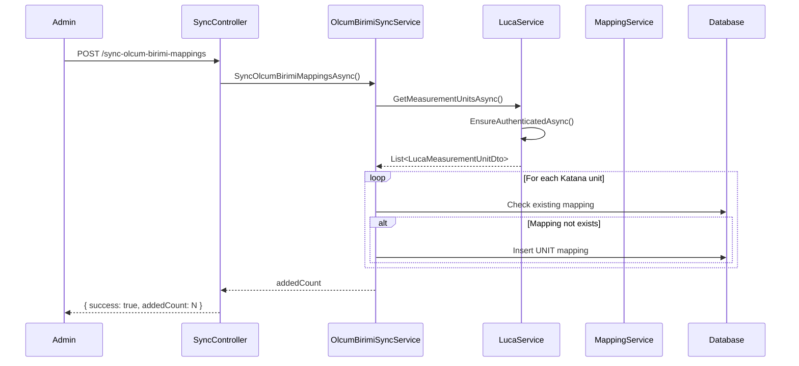
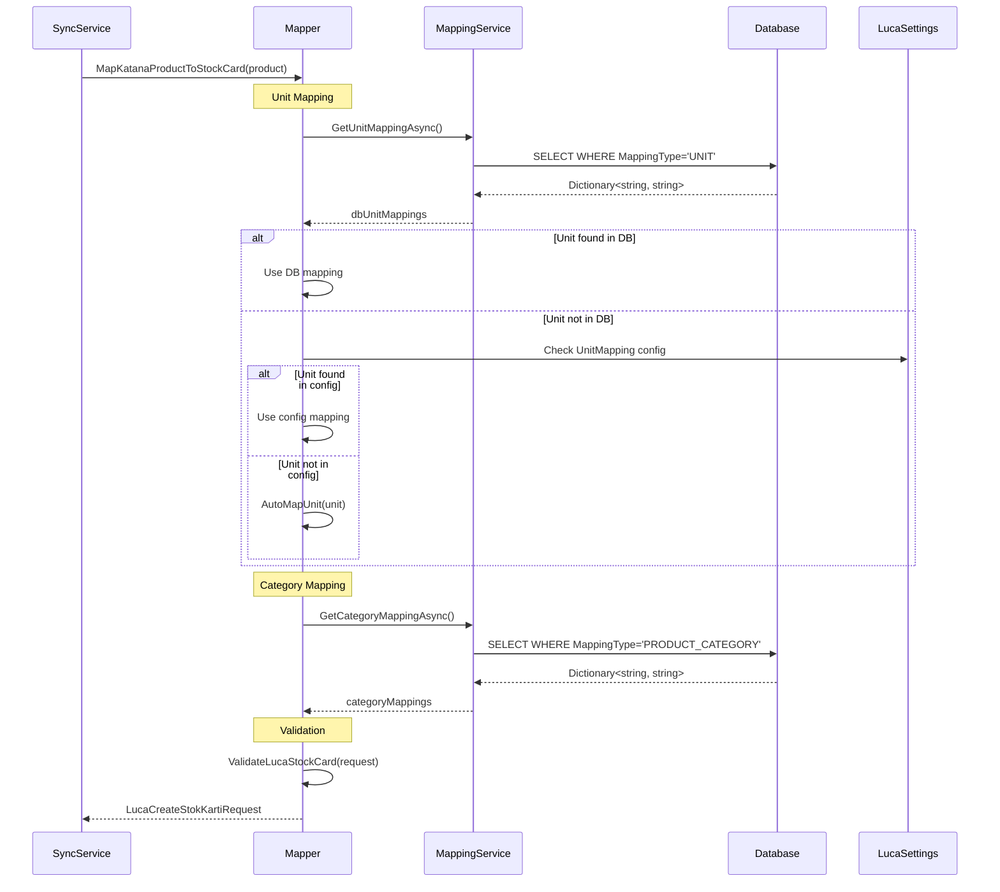

# Design Document

## Overview

Bu tasarım, Katana-Luca stok kartı senkronizasyonunu iyileştirmek için gerekli mimari değişiklikleri tanımlar. Çözüm, mevcut LucaService altyapısını kullanarak Luca'dan ölçü birimlerini dinamik olarak çeker, veritabanı tabanlı mapping sistemi kurar ve KatanaToLucaMapper'ı günceller.

### Temel Prensipler

1. **Mevcut Yapıyı Koruma**: Fatura senkronizasyonu ve diğer mevcut işlevler bozulmayacak
2. **Veritabanı Öncelikli Mapping**: Mapping'ler önce veritabanından, sonra config'den okunacak
3. **Geriye Uyumluluk**: Mevcut appsettings.json mapping'leri fallback olarak çalışmaya devam edecek
4. **Validasyon**: Luca'ya gönderilmeden önce tüm zorunlu alanlar kontrol edilecek

## Architecture

```
┌─────────────────────────────────────────────────────────────────────────────┐
│                              API Layer                                       │
│  ┌─────────────────────────────────────────────────────────────────────┐   │
│  │ SyncController                                                        │   │
│  │  - GET  /api/sync/list-luca-olcum-birimleri                          │   │
│  │  - POST /api/sync/sync-olcum-birimi-mappings                         │   │
│  │  - GET  /api/sync/test-single-product/{sku}                          │   │
│  │  - POST /api/sync/to-luca/stock-cards                                │   │
│  └─────────────────────────────────────────────────────────────────────┘   │
└─────────────────────────────────────────────────────────────────────────────┘
                                      │
                                      ▼
┌─────────────────────────────────────────────────────────────────────────────┐
│                           Business Layer                                     │
│  ┌──────────────────────┐  ┌──────────────────────┐  ┌─────────────────┐   │
│  │ OlcumBirimiSyncService│  │ KatanaToLucaMapper   │  │ MappingService  │   │
│  │ - SyncMappingsAsync() │  │ - MapKatanaProduct() │  │ - GetUnitMap()  │   │
│  │ - GetLucaUnits()      │  │ - ValidateCard()     │  │ - GetCatMap()   │   │
│  └──────────────────────┘  └──────────────────────┘  └─────────────────┘   │
└─────────────────────────────────────────────────────────────────────────────┘
                                      │
                                      ▼
┌─────────────────────────────────────────────────────────────────────────────┐
│                        Infrastructure Layer                                  │
│  ┌──────────────────────────────────────────────────────────────────────┐  │
│  │ LucaService                                                           │  │
│  │  - GetMeasurementUnitsAsync() [MEVCUT]                               │  │
│  │  - CreateStockCardAsync() [MEVCUT]                                   │  │
│  │  - ListStockCardsSimpleAsync() [MEVCUT]                              │  │
│  └──────────────────────────────────────────────────────────────────────┘  │
└─────────────────────────────────────────────────────────────────────────────┘
                                      │
                                      ▼
┌─────────────────────────────────────────────────────────────────────────────┐
│                            Data Layer                                        │
│  ┌──────────────────────────────────────────────────────────────────────┐  │
│  │ IntegrationDbContext                                                  │  │
│  │  - MappingTables (MappingType: UNIT, PRODUCT_CATEGORY, etc.)         │  │
│  └──────────────────────────────────────────────────────────────────────┘  │
└─────────────────────────────────────────────────────────────────────────────┘
```

## Components and Interfaces

### 1. OlcumBirimiSyncService (Yeni)

Luca'dan ölçü birimlerini çekip veritabanına mapping olarak kaydeden servis.

```csharp
public interface IOlcumBirimiSyncService
{
    Task<int> SyncOlcumBirimiMappingsAsync();
    Task<List<LucaOlcumBirimiDto>> GetLucaOlcumBirimleriAsync();
}
```

### 2. MappingService (Güncelleme)

Mevcut MappingService'e ölçü birimi mapping desteği eklenir.

```csharp
// Mevcut interface'e eklenen metodlar
public interface IMappingService
{
    // Mevcut metodlar...
    Task<Dictionary<string, string>> GetUnitMappingAsync();
    Task UpdateUnitMappingAsync(string katanaUnit, string lucaUnitId);
}
```

### 3. KatanaToLucaMapper (Güncelleme)

Mevcut mapper'a veritabanı mapping desteği ve gelişmiş validasyon eklenir.

```csharp
// MapKatanaProductToStockCard metoduna eklenen parametreler
public static LucaCreateStokKartiRequest MapKatanaProductToStockCard(
    KatanaProductDto product,
    LucaApiSettings lucaSettings,
    IReadOnlyDictionary<string, string>? productCategoryMappings = null,
    KatanaMappingSettings? mappingSettings = null,
    long? olcumBirimiIdOverride = null,
    IReadOnlyDictionary<string, int>? unitMappings = null,
    IReadOnlyDictionary<string, string>? dbUnitMappings = null  // YENİ
)
```

### 4. SyncController (Güncelleme)

Yeni endpoint'ler eklenir.

```csharp
[HttpGet("list-luca-olcum-birimleri")]
public async Task<IActionResult> ListLucaOlcumBirimleri();

[HttpPost("sync-olcum-birimi-mappings")]
public async Task<IActionResult> SyncOlcumBirimiMappings();

[HttpGet("test-single-product/{sku}")]
public async Task<IActionResult> TestSingleProductMapping(string sku);
```

## Data Models

### LucaOlcumBirimiDto (Yeni)

```csharp
public class LucaOlcumBirimiDto
{
    [JsonPropertyName("id")]
    public long Id { get; set; }

    [JsonPropertyName("kod")]
    public string Kod { get; set; } = string.Empty;

    [JsonPropertyName("ad")]
    public string Ad { get; set; } = string.Empty;

    [JsonPropertyName("kisa")]
    public string? Kisa { get; set; }

    [JsonPropertyName("aktif")]
    public bool Aktif { get; set; }
}
```

### LucaOlcumBirimiResponse (Yeni)

```csharp
public class LucaOlcumBirimiResponse
{
    [JsonPropertyName("data")]
    public List<LucaOlcumBirimiDto>? Data { get; set; }

    [JsonPropertyName("list")]
    public List<LucaOlcumBirimiDto>? List { get; set; }

    [JsonPropertyName("success")]
    public bool Success { get; set; }
}
```

### MappingTable (Mevcut - Kullanım Şekli)

```
MappingType     | SourceValue | TargetValue | Description
----------------|-------------|-------------|---------------------------
UNIT            | pcs         | 5           | pcs -> ADET (ID: 5)
UNIT            | kg          | 1           | kg -> KG (ID: 1)
UNIT            | m           | 3           | m -> METRE (ID: 3)
PRODUCT_CATEGORY| TATLANTIK   | 001         | Tatlantik Mamul -> 001
PRODUCT_CATEGORY| 3YARI MAMUL | 220         | 3 Yarı Mamul -> 220
```

## Correctness Properties

_A property is a characteristic or behavior that should hold true across all valid executions of a system-essentially, a formal statement about what the system should do. Properties serve as the bridge between human-readable specifications and machine-verifiable correctness guarantees._

### Property 1: Measurement Unit Response Parsing

_For any_ valid JSON response from Luca's ListeleGnlOlcumBirimi.do endpoint, parsing the response should produce LucaOlcumBirimiDto objects where each object has a non-negative Id and non-empty Ad field.
**Validates: Requirements 1.1, 1.2**

### Property 2: Unit Mapping Idempotency

_For any_ set of Luca measurement units, calling SyncOlcumBirimiMappingsAsync twice should result in the same number of UNIT mappings in the database (no duplicates created).
**Validates: Requirements 2.3**

### Property 3: Unit Mapping Count Correctness

_For any_ sync operation, the returned count of added mappings should equal the difference between the total UNIT mappings after sync and the total before sync.
**Validates: Requirements 2.5**

### Property 4: Unit Mapping Priority Chain

_For any_ Katana product with a unit string, the mapper should resolve OlcumBirimiId by checking: (1) database UNIT mappings, (2) LucaApiSettings.UnitMapping, (3) AutoMapUnit fallback, (4) DefaultOlcumBirimiId - in that exact order, using the first non-null result.
**Validates: Requirements 4.1, 4.2, 4.3, 4.4**

### Property 5: Category Mapping Fallback Chain

_For any_ Katana product with a category, the mapper should resolve KategoriAgacKod by checking: (1) database PRODUCT_CATEGORY mappings, (2) appsettings CategoryMapping, (3) DefaultKategoriKodu or null - in that exact order.
**Validates: Requirements 3.2, 3.3**

### Property 6: Numeric Category Detection

_For any_ category string containing only digits, the mapper should treat it as an internal ID and not use it directly as KategoriAgacKod.
**Validates: Requirements 3.4**

### Property 7: Price Mapping Correctness

_For any_ Katana product, PerakendeAlisBirimFiyat should equal CostPrice ?? PurchasePrice ?? 0, and PerakendeSatisBirimFiyat should equal SalesPrice ?? Price ?? 0.
**Validates: Requirements 5.1, 5.2, 5.4**

### Property 8: Versioned SKU Barcode Handling

_For any_ SKU matching the pattern `-V\d+$` (case insensitive), the mapped Barkod field should be null.
**Validates: Requirements 6.1**

### Property 9: Non-Versioned SKU Barcode Handling

_For any_ SKU not matching the version pattern, the mapped Barkod field should equal the product's Barcode if non-empty, otherwise the SKU.
**Validates: Requirements 6.2**

### Property 10: Stock Card Validation Completeness

_For any_ LucaCreateStokKartiRequest, validation should fail if KartKodu is empty OR KartAdi is empty OR OlcumBirimiId <= 0, and the thrown ValidationException should contain all applicable error messages.
**Validates: Requirements 10.1, 10.2, 10.3, 10.4**

### Property 11: Test Endpoint Response Structure

_For any_ valid SKU passed to test-single-product endpoint, the response should contain both katanaProduct and lucaRequest objects with non-null values.
**Validates: Requirements 7.1, 7.2**

## Error Handling

### API Errors

- **Luca Session Expired**: Re-authenticate automatically via EnsureAuthenticatedAsync()
- **Luca API Timeout**: Log error, return empty list, do not throw
- **Invalid JSON Response**: Log parse error with response preview, return empty list
- **HTTP Error Codes**: Log status code and response body, return appropriate error response

### Mapping Errors

- **Missing Unit Mapping**: Log warning, use AutoMapUnit fallback
- **Missing Category Mapping**: Log warning, use DefaultKategoriKodu or null
- **Invalid Mapping Data**: Skip invalid mapping, continue with next

### Validation Errors

- **Empty Required Fields**: Throw ValidationException with field names
- **Invalid OlcumBirimiId**: Throw ValidationException with current value
- **Multiple Errors**: Concatenate all error messages in exception

## Testing Strategy

### Unit Testing Framework

- **Framework**: xUnit
- **Mocking**: Moq for service dependencies
- **Assertions**: FluentAssertions for readable assertions

### Property-Based Testing Framework

- **Framework**: FsCheck.Xunit
- **Minimum Iterations**: 100 per property
- **Generators**: Custom generators for KatanaProductDto, LucaOlcumBirimiDto

### Test Categories

#### Unit Tests

1. **OlcumBirimiSyncService Tests**

   - Test successful sync with mock Luca response
   - Test handling of empty Luca response
   - Test duplicate prevention

2. **KatanaToLucaMapper Tests**

   - Test unit mapping priority chain
   - Test category mapping fallback
   - Test versioned SKU detection
   - Test price mapping
   - Test validation

3. **SyncController Tests**
   - Test endpoint responses
   - Test error handling

#### Property-Based Tests

Each correctness property (1-11) will have a corresponding property-based test that:

- Generates random valid inputs
- Verifies the property holds for all generated inputs
- Uses shrinking to find minimal failing examples

### Test Annotations

All property-based tests must include:

```csharp
// **Feature: katana-luca-stock-sync, Property {number}: {property_text}**
// **Validates: Requirements X.Y**
```

## Sequence Diagrams

### Ölçü Birimi Sync Flow



### Stok Kartı Mapping Flow


