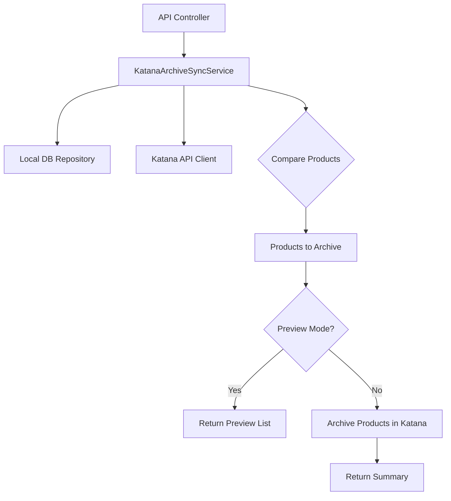

# Design Document: Katana Product Archive Sync

## Overview

Bu özellik, yerel veritabanımızı kaynak (source of truth) olarak kabul ederek Katana API'sindeki ürünleri senkronize eder. Katana'da var olup yerel veritabanımızda bulunmayan ürünler `{"is_archived": true}` ile arşivlenir.

### Key Design Decisions

1. **SKU-based Matching**: Ürünler SKU bazında eşleştirilir (case-insensitive)
2. **Soft Archive**: Ürünler silinmez, sadece arşivlenir (`is_archived: true`)
3. **Preview Mode**: Değişiklik yapmadan önce önizleme imkanı
4. **Batch Processing**: Rate limiting'e uygun batch işleme
5. **Idempotent**: Aynı işlem tekrar çalıştırılabilir

## Architecture



## Components and Interfaces

### 1. IKatanaArchiveSyncService

```csharp
public interface IKatanaArchiveSyncService
{
    /// <summary>
    /// Katana'da olup local DB'de olmayan ürünleri bulur ve arşivler
    /// </summary>
    Task<ArchiveSyncResult> SyncArchiveAsync(bool previewOnly = false);

    /// <summary>
    /// Arşivlenecek ürünlerin önizlemesini döner
    /// </summary>
    Task<List<ProductArchivePreview>> GetArchivePreviewAsync();
}
```

### 2. KatanaArchiveSyncService

Ana senkronizasyon servisi. Şu adımları gerçekleştirir:

1. Local DB'den tüm aktif ürünlerin SKU'larını çeker
2. Katana API'den tüm ürünleri çeker
3. SKU bazında karşılaştırma yapar
4. Katana'da olup local DB'de olmayan ürünleri tespit eder
5. Preview modunda sadece liste döner
6. Execute modunda ürünleri arşivler

### 3. IKatanaService Extension

Mevcut `IKatanaService`'e arşivleme metodu eklenir:

```csharp
Task<bool> ArchiveProductAsync(int productId);
```

### 4. API Controller

```csharp
[ApiController]
[Route("api/admin/[controller]")]
[Authorize(Roles = "Admin,Manager")]
public class KatanaArchiveSyncController : ControllerBase
{
    [HttpPost("sync")]
    public async Task<ActionResult<ArchiveSyncResult>> SyncArchive([FromQuery] bool previewOnly = false);

    [HttpGet("preview")]
    public async Task<ActionResult<List<ProductArchivePreview>>> GetPreview();
}
```

## Data Models

### ArchiveSyncResult

```csharp
public class ArchiveSyncResult
{
    public int TotalKatanaProducts { get; set; }
    public int TotalLocalProducts { get; set; }
    public int ProductsToArchive { get; set; }
    public int ArchivedSuccessfully { get; set; }
    public int ArchiveFailed { get; set; }
    public List<ProductArchivePreview> ArchivedProducts { get; set; } = new();
    public List<ArchiveError> Errors { get; set; } = new();
    public DateTime SyncStartedAt { get; set; }
    public DateTime SyncCompletedAt { get; set; }
    public bool IsPreviewOnly { get; set; }
}
```

### ProductArchivePreview

```csharp
public class ProductArchivePreview
{
    public int KatanaProductId { get; set; }
    public string SKU { get; set; } = string.Empty;
    public string Name { get; set; } = string.Empty;
    public bool IsAlreadyArchived { get; set; }
}
```

### ArchiveError

```csharp
public class ArchiveError
{
    public int KatanaProductId { get; set; }
    public string SKU { get; set; } = string.Empty;
    public string ErrorMessage { get; set; } = string.Empty;
}
```

## Correctness Properties

_A property is a characteristic or behavior that should hold true across all valid executions of a system-essentially, a formal statement about what the system should do. Properties serve as the bridge between human-readable specifications and machine-verifiable correctness guarantees._

### Property 1: SKU Matching Correctness

_For any_ set of local products and Katana products, a Katana product should be marked for archiving if and only if its SKU (case-insensitive) does not exist in the local product set.
**Validates: Requirements 1.2, 1.3**

### Property 2: Preview Mode Immutability

_For any_ preview operation, the number of Katana API PATCH calls should be zero, and the returned list should contain all products that would be archived.
**Validates: Requirements 2.1, 3.2**

### Property 3: Archive Summary Consistency

_For any_ archive operation, the sum of `ArchivedSuccessfully` and `ArchiveFailed` should equal `ProductsToArchive`.
**Validates: Requirements 1.5**

### Property 4: Partial Failure Resilience

_For any_ archive operation where some products fail to archive, the remaining products should still be processed and the operation should complete with a summary.
**Validates: Requirements 3.4**

### Property 5: Preview Result Completeness

_For any_ preview result, each item should contain non-empty KatanaProductId, SKU, and Name fields.
**Validates: Requirements 2.2, 2.3**

## Error Handling

### Rate Limiting

- Katana API 429 yanıtı için exponential backoff (1s, 2s, 4s, max 3 retry)
- Batch işlemler arasında 100ms delay

### API Errors

- Her hata loglanır (product ID, SKU, error message)
- Tek bir ürün hatası tüm işlemi durdurmaz
- Hata detayları sonuç nesnesinde döner

### Network Errors

- Timeout: 30 saniye
- Connection error: 3 retry with backoff

## Testing Strategy

### Unit Tests

- SKU matching logic
- Preview vs Execute mode behavior
- Error aggregation

### Property-Based Tests

Library: **FsCheck** (C# için)

1. **Property 1 Test**: Random product sets ile SKU matching doğruluğu
2. **Property 2 Test**: Preview modunda PATCH çağrısı yapılmadığını doğrulama
3. **Property 3 Test**: Summary count tutarlılığı
4. **Property 4 Test**: Partial failure senaryolarında devam etme
5. **Property 5 Test**: Preview sonuçlarının tüm gerekli alanları içermesi

Her property-based test minimum 100 iterasyon çalıştırılacak.

Test annotation formatı: `**Feature: katana-product-archive-sync, Property {number}: {property_text}**`
