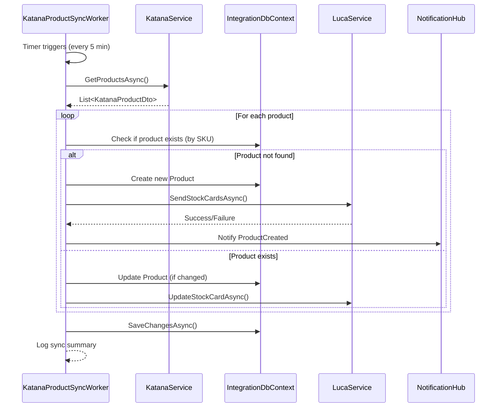

# Design Document

## Overview

Bu özellik, Katana API'den ürünlerin otomatik olarak yerel veritabanına senkronize edilmesini sağlayan bir background worker servisi ekler. Mevcut `KatanaSalesOrderSyncWorker` pattern'ini takip ederek, periyodik olarak Katana'dan ürünleri çeker, yerel database'e kaydeder ve Luca'ya stok kartı olarak gönderir.

## Architecture

### Component Diagram

```
┌─────────────────────────────────────────────────────────────┐
│                    Katana API                                │
└────────────────────┬────────────────────────────────────────┘
                     │ HTTP GET /products
                     │
┌────────────────────▼────────────────────────────────────────┐
│         KatanaProductSyncWorker (Background Service)         │
│  - ExecuteAsync(): Periyodik çalışma (5 dakika)            │
│  - SyncProductsAsync(): Ürün senkronizasyon mantığı        │
│  - CreateOrUpdateProduct(): Ürün kaydetme                   │
└────────────────────┬────────────────────────────────────────┘
                     │
        ┌────────────┴────────────┐
        │                         │
┌───────▼──────────┐    ┌────────▼─────────┐
│  IntegrationDb   │    │   LucaService    │
│  Products Table  │    │  Stock Cards API │
└──────────────────┘    └──────────────────┘
```

### Sequence Diagram



## Components and Interfaces

### 1. KatanaProductSyncWorker

Background service that runs periodically to sync products from Katana API.

```csharp
public class KatanaProductSyncWorker : BackgroundService
{
    private readonly IServiceProvider _services;
    private readonly ILogger<KatanaProductSyncWorker> _logger;
    private readonly TimeSpan _interval; // From configuration

    protected override async Task ExecuteAsync(CancellationToken stoppingToken)
    {
        // Wait for app startup
        await Task.Delay(TimeSpan.FromSeconds(30), stoppingToken);

        while (!stoppingToken.IsCancellationRequested)
        {
            await SyncProductsAsync(stoppingToken);
            await Task.Delay(_interval, stoppingToken);
        }
    }

    private async Task SyncProductsAsync(CancellationToken cancellationToken)
    {
        // Fetch products from Katana
        // Compare with local database
        // Create/Update products
        // Trigger Luca sync
        // Send notifications
    }
}
```

### 2. Configuration Settings

Add to `appsettings.json`:

```json
{
  "BackgroundServices": {
    "ProductSync": {
      "Enabled": true,
      "IntervalMinutes": 5,
      "DefaultCategoryId": 1
    }
  }
}
```

### 3. Service Registration

Update `Program.cs`:

```csharp
var enableBackground = string.Equals(
    Environment.GetEnvironmentVariable("ENABLE_BACKGROUND_SERVICES"),
    "true",
    StringComparison.OrdinalIgnoreCase);

if (enableBackground)
{
    builder.Services.AddHostedService<KatanaProductSyncWorker>();
}
```

### 4. Product Sync Logic

```csharp
private async Task SyncProductsAsync(CancellationToken cancellationToken)
{
    using var scope = _services.CreateScope();
    var katanaService = scope.ServiceProvider.GetRequiredService<IKatanaService>();
    var productService = scope.ServiceProvider.GetRequiredService<IProductService>();
    var lucaService = scope.ServiceProvider.GetRequiredService<ILucaService>();
    var context = scope.ServiceProvider.GetRequiredService<IntegrationDbContext>();

    // 1. Fetch all products from Katana
    var katanaProducts = await katanaService.GetProductsAsync();

    // 2. Get existing products from database
    var existingProducts = await context.Products
        .ToDictionaryAsync(p => p.SKU, p => p, cancellationToken);

    var created = 0;
    var updated = 0;
    var errors = new List<string>();

    // 3. Process each product
    foreach (var katanaProduct in katanaProducts)
    {
        try
        {
            if (!existingProducts.ContainsKey(katanaProduct.SKU))
            {
                // Create new product
                var newProduct = await CreateProductAsync(katanaProduct, context);
                created++;

                // Trigger Luca sync
                await SyncToLucaAsync(newProduct, lucaService);
            }
            else
            {
                // Update existing product if changed
                var existing = existingProducts[katanaProduct.SKU];
                if (HasChanges(existing, katanaProduct))
                {
                    await UpdateProductAsync(existing, katanaProduct, context);
                    updated++;

                    // Update Luca stock card
                    await UpdateLucaStockCardAsync(existing, lucaService);
                }
            }
        }
        catch (Exception ex)
        {
            errors.Add($"SKU {katanaProduct.SKU}: {ex.Message}");
            _logger.LogError(ex, "Error syncing product {SKU}", katanaProduct.SKU);
        }
    }

    // 4. Save all changes
    await context.SaveChangesAsync(cancellationToken);

    // 5. Log summary
    _logger.LogInformation(
        "Product sync completed: {Created} created, {Updated} updated, {Errors} errors",
        created, updated, errors.Count);
}
```

## Data Models

### Product Entity (Existing)

```csharp
public class Product
{
    public int Id { get; set; }
    public string SKU { get; set; }
    public string Name { get; set; }
    public decimal Price { get; set; }
    public decimal Stock { get; set; }
    public int CategoryId { get; set; }
    public string? MainImageUrl { get; set; }
    public string? Description { get; set; }
    public bool IsActive { get; set; }
    public DateTime CreatedAt { get; set; }
    public DateTime? UpdatedAt { get; set; }

    // Luca sync fields
    public string? Barcode { get; set; }
    public string? KategoriAgacKod { get; set; }
    public decimal? PurchasePrice { get; set; }
    public string? GtipCode { get; set; }
    public string? UzunAdi { get; set; }
    public int? LucaId { get; set; }
}
```

### SyncLog Entity (New)

```csharp
public class ProductSyncLog
{
    public int Id { get; set; }
    public DateTime SyncStartedAt { get; set; }
    public DateTime? SyncCompletedAt { get; set; }
    public int ProductsCreated { get; set; }
    public int ProductsUpdated { get; set; }
    public int ProductsSkipped { get; set; }
    public int ErrorCount { get; set; }
    public string? ErrorDetails { get; set; }
    public string Status { get; set; } // Running, Completed, Failed
}
```

## Correctness Properties

_A property is a characteristic or behavior that should hold true across all valid executions of a system-essentially, a formal statement about what the system should do. Properties serve as the bridge between human-readable specifications and machine-verifiable correctness guarantees._

### Property 1: Sync interval enforcement

_For any_ configured sync interval greater than or equal to 1 minute, the worker should wait exactly that interval between sync operations
**Validates: Requirements 2.3**

### Property 2: New product creation

_For any_ product from Katana API that does not exist in local database (by SKU), the system should create a new Product entity with all mapped fields
**Validates: Requirements 1.3**

### Property 3: Duplicate prevention

_For any_ product SKU, there should be at most one Product entity in the database with that SKU
**Validates: Requirements 1.3**

### Property 4: Luca sync trigger

_For any_ newly created product, the system should attempt to create a corresponding stock card in Luca
**Validates: Requirements 3.1**

### Property 5: Error isolation

_For any_ product sync error, the system should log the error and continue processing remaining products without failing the entire sync operation
**Validates: Requirements 1.5**

### Property 6: Sync status logging

_For any_ completed sync operation, the system should log a summary containing created count, updated count, and error count
**Validates: Requirements 4.1**

### Property 7: Concurrent sync prevention

_For any_ running sync operation, if another sync is triggered, the system should skip or queue the new request
**Validates: Requirements 4.5**

### Property 8: Configuration validation

_For any_ sync interval configuration less than 1 minute, the system should reject it and use the default interval
**Validates: Requirements 2.4**

### Property 9: Backward compatibility

_For any_ existing manual sync endpoint call with `sync=true`, the system should perform synchronization and return results
**Validates: Requirements 5.1, 5.5**

### Property 10: LucaId update

_For any_ successful Luca stock card creation, the system should update the Product entity with the returned LucaId
**Validates: Requirements 3.2**

## Error Handling

### 1. Katana API Unavailable

- Log error with details
- Skip current sync cycle
- Retry on next scheduled run
- Do not crash the worker

### 2. Database Connection Failure

- Log error with connection details
- Retry with exponential backoff (3 attempts)
- If all retries fail, skip cycle and continue

### 3. Luca API Failure

- Log error for specific product
- Mark product for retry (add to retry queue)
- Continue processing other products
- Retry failed products on next cycle

### 4. Invalid Product Data

- Log validation error with product SKU
- Skip invalid product
- Continue processing remaining products
- Include in error count summary

### 5. Duplicate SKU Conflict

- Log warning with existing product ID
- Skip creation
- Optionally update existing product
- Continue processing

## Testing Strategy

### Unit Tests

1. **Worker Lifecycle Tests**

   - Test worker starts correctly
   - Test worker stops gracefully
   - Test interval timing

2. **Sync Logic Tests**

   - Test new product creation
   - Test existing product update
   - Test duplicate SKU handling
   - Test error handling for individual products

3. **Configuration Tests**
   - Test default interval usage
   - Test custom interval configuration
   - Test invalid interval rejection

### Property-Based Tests

We will use **xUnit** with **FsCheck** for property-based testing in C#.

**Property 1: Sync interval enforcement**

- Generate random valid intervals (1-60 minutes)
- Verify worker waits exactly that duration
- **Validates: Requirements 2.3**

**Property 2: New product creation**

- Generate random Katana products
- Verify each creates exactly one database entry
- **Validates: Requirements 1.3**

**Property 3: Duplicate prevention**

- Generate products with duplicate SKUs
- Verify only one entry per SKU exists
- **Validates: Requirements 1.3**

**Property 4: Luca sync trigger**

- Generate random new products
- Verify Luca API called for each
- **Validates: Requirements 3.1**

**Property 5: Error isolation**

- Generate mix of valid/invalid products
- Verify valid products processed despite errors
- **Validates: Requirements 1.5**

**Property 6: Sync status logging**

- Generate random sync results
- Verify log contains all counts
- **Validates: Requirements 4.1**

**Property 7: Concurrent sync prevention**

- Trigger multiple concurrent syncs
- Verify only one executes at a time
- **Validates: Requirements 4.5**

**Property 8: Configuration validation**

- Generate random interval values
- Verify values < 1 minute rejected
- **Validates: Requirements 2.4**

**Property 9: Backward compatibility**

- Call manual sync endpoint with various parameters
- Verify results match expected format
- **Validates: Requirements 5.1, 5.5**

**Property 10: LucaId update**

- Generate random Luca responses
- Verify Product.LucaId updated correctly
- **Validates: Requirements 3.2**

### Integration Tests

1. **End-to-End Sync Test**

   - Mock Katana API with test products
   - Run worker sync cycle
   - Verify database state
   - Verify Luca API calls

2. **Error Recovery Test**

   - Simulate Katana API failure
   - Verify worker continues on next cycle
   - Verify no data corruption

3. **Performance Test**
   - Test with 1000+ products
   - Verify sync completes within reasonable time
   - Verify memory usage stays bounded

## Implementation Notes

### 1. Retry Policy

Use Polly for resilient HTTP calls:

```csharp
private static readonly AsyncRetryPolicy _katanaApiRetryPolicy = Policy
    .Handle<HttpRequestException>()
    .Or<TimeoutException>()
    .WaitAndRetryAsync(
        retryCount: 3,
        sleepDurationProvider: attempt => TimeSpan.FromSeconds(Math.Pow(2, attempt)),
        onRetry: (exception, delay, attempt, context) =>
        {
            // Log retry attempt
        });
```

### 2. Memory Management

For large product lists (1000+):

- Process in batches of 100
- Call `GC.Collect(0, GCCollectionMode.Optimized)` after each batch
- Use `AsNoTracking()` for read-only queries

### 3. Concurrency Control

Use a semaphore to prevent concurrent syncs:

```csharp
private static readonly SemaphoreSlim _syncLock = new(1, 1);

private async Task SyncProductsAsync(CancellationToken cancellationToken)
{
    if (!await _syncLock.WaitAsync(0, cancellationToken))
    {
        _logger.LogWarning("Sync already running, skipping this cycle");
        return;
    }

    try
    {
        // Sync logic
    }
    finally
    {
        _syncLock.Release();
    }
}
```

### 4. SignalR Notifications

Send real-time notifications to frontend:

```csharp
await _hubContext.Clients.All.SendAsync("ProductSyncCompleted", new
{
    created = createdCount,
    updated = updatedCount,
    errors = errorCount,
    timestamp = DateTime.UtcNow
}, cancellationToken);
```

### 5. Logging Best Practices

- Use structured logging with Serilog
- Log at appropriate levels (Debug, Info, Warning, Error)
- Include correlation IDs for tracing
- Mask sensitive data (API keys, passwords)

## Dependencies

- **Existing**: `IKatanaService`, `IProductService`, `ILucaService`
- **Existing**: `IntegrationDbContext`, `IHubContext<NotificationHub>`
- **Existing**: `ILogger<T>`, `IServiceProvider`
- **New**: Configuration section `BackgroundServices:ProductSync`
- **New**: `ProductSyncLog` entity and DbSet

## Migration Path

1. Add `ProductSyncLog` table migration
2. Add configuration section to appsettings
3. Implement `KatanaProductSyncWorker`
4. Register worker in `Program.cs`
5. Test with `ENABLE_BACKGROUND_SERVICES=true`
6. Monitor logs for first few sync cycles
7. Gradually increase sync frequency if needed

## Performance Considerations

- **Batch Size**: Process 100 products at a time
- **Timeout**: 120 seconds for Katana API calls
- **Memory**: Use streaming for large datasets
- **Database**: Use bulk operations where possible
- **Caching**: Cache category mappings to reduce DB queries

## Security Considerations

- Worker runs with application service account
- No user authentication required (background process)
- API keys stored in configuration (encrypted in production)
- Validate all data from external APIs before saving
- Use parameterized queries to prevent SQL injection
