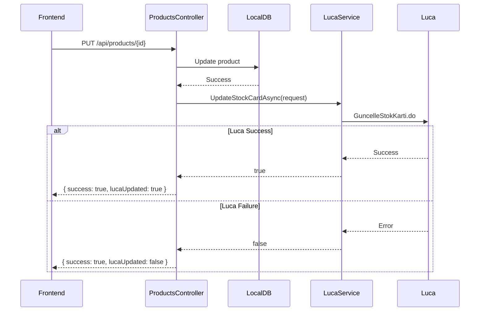
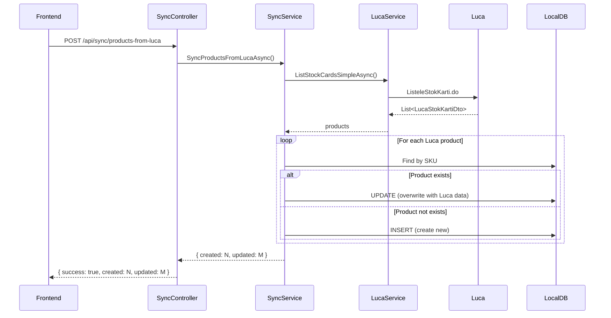

# Design Document

## Overview

Bu tasarım, Luca/Koza ürün senkronizasyonunu düzeltmek için gerekli değişiklikleri tanımlar. Ana prensip: **Luca her zaman "single source of truth" (tek doğru kaynak) olmalı**.

### Temel Prensipler

1. **Luca = Tek Doğru Kaynak**: Koza'dan çekildiğinde Luca verisi her zaman local DB'nin üzerine yazılır
2. **Çift Yönlü Güncelleme**: Frontend'den güncelleme yapıldığında hem local DB hem Luca güncellenir
3. **Timestamp Karşılaştırması YOK**: "Koza'dan Çek" işleminde timestamp kontrolü yapılmaz
4. **Hata Toleransı**: Luca hatası local güncellemeyi engellemez

## Architecture

```
┌─────────────────────────────────────────────────────────────────────────────┐
│                              Frontend                                        │
│  ┌─────────────────────────────────────────────────────────────────────┐   │
│  │ ProductEditModal                                                      │   │
│  │  - Sadece Luca-editable alanları gösterir                            │   │
│  │  - PUT /api/products/{id} çağırır                                    │   │
│  └─────────────────────────────────────────────────────────────────────┘   │
└─────────────────────────────────────────────────────────────────────────────┘
                                      │
                                      ▼
┌─────────────────────────────────────────────────────────────────────────────┐
│                              API Layer                                       │
│  ┌─────────────────────────────────────────────────────────────────────┐   │
│  │ ProductsController                                                    │   │
│  │  - PUT /api/products/{id} → Local DB + Luca güncelle                 │   │
│  └─────────────────────────────────────────────────────────────────────┘   │
│  ┌─────────────────────────────────────────────────────────────────────┐   │
│  │ SyncController                                                        │   │
│  │  - POST /api/sync/products-from-luca → Luca'dan çek, local'e yaz     │   │
│  └─────────────────────────────────────────────────────────────────────┘   │
└─────────────────────────────────────────────────────────────────────────────┘
                                      │
                                      ▼
┌─────────────────────────────────────────────────────────────────────────────┐
│                        Infrastructure Layer                                  │
│  ┌──────────────────────────────────────────────────────────────────────┐  │
│  │ LucaService                                                           │  │
│  │  - UpdateStockCardAsync() [YENİ]                                     │  │
│  │  - ListStockCardsSimpleAsync() [MEVCUT]                              │  │
│  └──────────────────────────────────────────────────────────────────────┘  │
└─────────────────────────────────────────────────────────────────────────────┘
```

## Components and Interfaces

### 1. ProductsController (Güncelleme)

```csharp
[HttpPut("{id}")]
[Authorize(Roles = "Admin")]
public async Task<IActionResult> UpdateProduct(int id, [FromBody] UpdateProductRequest request)
{
    // 1. Local DB'yi güncelle
    // 2. Luca'ya gönder (hata olsa bile devam et)
    // 3. Response dön
}
```

### 2. LucaService (Güncelleme)

```csharp
public interface ILucaService
{
    // Mevcut metodlar...
    Task<bool> UpdateStockCardAsync(LucaUpdateStokKartiRequest request);
}
```

### 3. SyncService (Güncelleme)

```csharp
public async Task<SyncResultDto> SyncProductsFromLucaAsync()
{
    // 1. Luca'dan tüm ürünleri çek
    // 2. Her ürün için: Local'de varsa güncelle, yoksa oluştur
    // 3. Timestamp karşılaştırması YAPMA
    // 4. Sonuç dön
}
```

## Data Models

### UpdateProductRequest (Yeni)

```csharp
public class UpdateProductRequest
{
    public string? Name { get; set; }           // kartAdi
    public string? UzunAdi { get; set; }        // uzunAdi
    public string? Barcode { get; set; }        // barkod
    public int? CategoryId { get; set; }        // kategoriAgacKod (DB'den mapping)
    public int? UnitId { get; set; }            // olcumBirimiId (DB'den mapping)
    public decimal? Quantity { get; set; }      // miktar
    public decimal? PurchasePrice { get; set; } // perakendeAlisBirimFiyat
    public decimal? SalesPrice { get; set; }    // perakendeSatisBirimFiyat
    public decimal? KdvRate { get; set; }       // KDV oranı
    public string? GtipCode { get; set; }       // gtipKodu
}
```

### LucaUpdateStokKartiRequest (Yeni)

```csharp
public class LucaUpdateStokKartiRequest
{
    [JsonPropertyName("skartId")]
    public long SkartId { get; set; }

    [JsonPropertyName("kartKodu")]
    public string KartKodu { get; set; } = string.Empty;

    [JsonPropertyName("kartAdi")]
    public string KartAdi { get; set; } = string.Empty;

    [JsonPropertyName("uzunAdi")]
    public string? UzunAdi { get; set; }

    [JsonPropertyName("barkod")]
    public string? Barkod { get; set; }

    [JsonPropertyName("kategoriAgacKod")]
    public string? KategoriAgacKod { get; set; }

    [JsonPropertyName("olcumBirimiId")]
    public long OlcumBirimiId { get; set; }

    [JsonPropertyName("perakendeAlisBirimFiyat")]
    public double PerakendeAlisBirimFiyat { get; set; }

    [JsonPropertyName("perakendeSatisBirimFiyat")]
    public double PerakendeSatisBirimFiyat { get; set; }

    [JsonPropertyName("gtipKodu")]
    public string? GtipKodu { get; set; }
}
```

## Correctness Properties

_A property is a characteristic or behavior that should hold true across all valid executions of a system-essentially, a formal statement about what the system should do. Properties serve as the bridge between human-readable specifications and machine-verifiable correctness guarantees._

### Property 1: Luca Update Contains LucaId

_For any_ product with a non-null LucaId, when mapped to LucaUpdateStokKartiRequest, the SkartId field should equal the product's LucaId.
**Validates: Requirements 1.4**

### Property 2: Sync Overwrites Local Data

_For any_ set of Luca products, after SyncProductsFromLucaAsync completes, every local product with matching SKU should have Name, Barcode, SalesPrice, and CostPrice equal to the corresponding Luca product values.
**Validates: Requirements 2.1, 2.2**

### Property 3: Sync Creates Missing Products

_For any_ Luca product with a SKU not present in local DB, after SyncProductsFromLucaAsync completes, a new local product should exist with that SKU.
**Validates: Requirements 2.3**

### Property 4: Sync Count Accuracy

_For any_ sync operation, the returned createdCount + updatedCount should equal the total number of products processed from Luca.
**Validates: Requirements 2.4**

### Property 5: Category Mapping Correctness

_For any_ product with a CategoryId that exists in PRODUCT_CATEGORY mappings, the mapped KategoriAgacKod should equal the TargetValue from the mapping.
**Validates: Requirements 3.2**

### Property 6: Unit Mapping Correctness

_For any_ product with a UnitId that exists in UNIT mappings, the mapped OlcumBirimiId should equal the parsed TargetValue from the mapping.
**Validates: Requirements 3.3**

### Property 7: Null Field Preservation

_For any_ UpdateProductRequest with a null field, after update, the corresponding local DB field should retain its previous value.
**Validates: Requirements 3.4**

### Property 8: Luca API Success Returns True

_For any_ successful Luca API response (HTTP 200 with success=true), UpdateStockCardAsync should return true.
**Validates: Requirements 5.3**

### Property 9: Luca API Error Returns False

_For any_ failed Luca API response (HTTP error or success=false), UpdateStockCardAsync should return false.
**Validates: Requirements 5.4**

## Error Handling

### Product Update Errors

- **Luca Update Fails**: Log warning, return success for local update
- **Local DB Update Fails**: Return error, do not attempt Luca update
- **Mapping Not Found**: Use default values, log warning

### Sync Errors

- **Luca API Fails**: Return error with message
- **Single Product Fails**: Log error, continue with next product
- **Partial Success**: Return success with counts

## Testing Strategy

### Unit Testing Framework

- **Framework**: xUnit
- **Mocking**: Moq for service dependencies
- **Assertions**: FluentAssertions

### Property-Based Testing Framework

- **Framework**: FsCheck.Xunit
- **Minimum Iterations**: 100 per property

### Test Categories

#### Unit Tests

1. **ProductsController Tests**

   - Test successful update with Luca sync
   - Test update when Luca fails
   - Test mapping to LucaUpdateStokKartiRequest

2. **SyncService Tests**

   - Test sync overwrites local data
   - Test sync creates new products
   - Test sync count accuracy

3. **LucaService Tests**
   - Test UpdateStockCardAsync success
   - Test UpdateStockCardAsync failure
   - Test session re-authentication

### Test Annotations

All property-based tests must include:

```csharp
// **Feature: luca-product-sync-fix, Property {number}: {property_text}**
// **Validates: Requirements X.Y**
```

## Sequence Diagrams

### Ürün Güncelleme Flow



### Koza'dan Çek Flow


