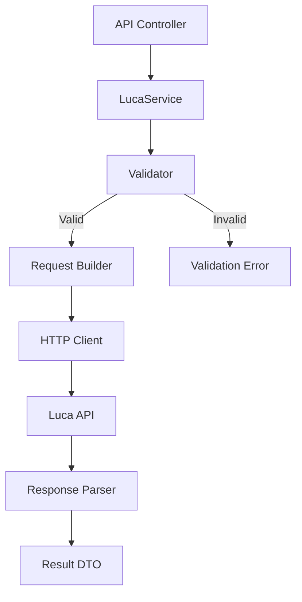

# Design Document: Luca Stock Card Create

## Overview

Bu tasarım, Katana sisteminden Luca API'ye stok kartı oluşturma özelliğini tanımlar. Mevcut `LucaService.StockCards.cs` dosyasındaki implementasyon güncellenecek ve verilen API formatına uygun hale getirilecektir.

**API Endpoint:** `EkleStkWsKart.do`

**Request Format:**

```json
{
  "kartAdi": "Test Ürünü",
  "kartKodu": "00013225",
  "kartTipi": 1,
  "kartAlisKdvOran": 1,
  "olcumBirimiId": 1,
  "baslangicTarihi": "06/04/2022",
  "kartTuru": 1,
  "kategoriAgacKod": null,
  "barkod": "8888888",
  "alisTevkifatOran": "7/10",
  "satisTevkifatOran": "2/10",
  "alisTevkifatTipId": 1,
  "satisTevkifatTipId": 1,
  "satilabilirFlag": 1,
  "satinAlinabilirFlag": 1,
  "lotNoFlag": 1,
  "minStokKontrol": 0,
  "maliyetHesaplanacakFlag": true
}
```

**Response Format:**

```json
{
  "skartId": 79409,
  "error": false,
  "message": "00013225 - Test Ürünü stok kartı başarılı bir şekilde kaydedilmiştir."
}
```

## Architecture



### Katmanlar:

1. **API Controller** (`KozaStockCardsController`): HTTP endpoint'leri
2. **LucaService**: İş mantığı ve API iletişimi
3. **Validator**: Request validasyonu
4. **Request Builder**: DTO'dan JSON request oluşturma
5. **Response Parser**: Luca response'unu parse etme

## Components and Interfaces

### 1. Request DTO (Güncelleme)

Mevcut `LucaCreateStokKartiRequest` DTO'su güncellenerek yeni API formatına uygun hale getirilecek:

```csharp
public class LucaCreateStockCardRequest
{
    // Required fields
    [JsonPropertyName("kartAdi")]
    public string KartAdi { get; set; } = string.Empty;

    [JsonPropertyName("kartKodu")]
    public string KartKodu { get; set; } = string.Empty;

    [JsonPropertyName("baslangicTarihi")]
    public string BaslangicTarihi { get; set; } = string.Empty; // dd/MM/yyyy format

    [JsonPropertyName("kartTuru")]
    public int KartTuru { get; set; } = 1; // 1=Stok, 2=Hizmet

    // Optional fields
    [JsonPropertyName("kartTipi")]
    public int? KartTipi { get; set; }

    [JsonPropertyName("kartAlisKdvOran")]
    public double? KartAlisKdvOran { get; set; }

    [JsonPropertyName("olcumBirimiId")]
    public int? OlcumBirimiId { get; set; }

    [JsonPropertyName("kategoriAgacKod")]
    public string? KategoriAgacKod { get; set; }

    [JsonPropertyName("barkod")]
    public string? Barkod { get; set; }

    // Tevkifat fields
    [JsonPropertyName("alisTevkifatOran")]
    public string? AlisTevkifatOran { get; set; } // e.g., "7/10"

    [JsonPropertyName("satisTevkifatOran")]
    public string? SatisTevkifatOran { get; set; } // e.g., "2/10"

    [JsonPropertyName("alisTevkifatTipId")]
    public int? AlisTevkifatTipId { get; set; }

    [JsonPropertyName("satisTevkifatTipId")]
    public int? SatisTevkifatTipId { get; set; }

    // Boolean flags (defaults)
    [JsonPropertyName("satilabilirFlag")]
    public int SatilabilirFlag { get; set; } = 1;

    [JsonPropertyName("satinAlinabilirFlag")]
    public int SatinAlinabilirFlag { get; set; } = 1;

    [JsonPropertyName("lotNoFlag")]
    public int LotNoFlag { get; set; } = 0;

    [JsonPropertyName("minStokKontrol")]
    public int MinStokKontrol { get; set; } = 0;

    [JsonPropertyName("maliyetHesaplanacakFlag")]
    public bool MaliyetHesaplanacakFlag { get; set; } = true;
}
```

### 2. Response DTO

```csharp
public class LucaCreateStockCardResponse
{
    [JsonPropertyName("skartId")]
    public long? SkartId { get; set; }

    [JsonPropertyName("error")]
    public bool Error { get; set; }

    [JsonPropertyName("message")]
    public string? Message { get; set; }
}
```

### 3. Validator Interface

```csharp
public interface IStockCardValidator
{
    ValidationResult Validate(LucaCreateStockCardRequest request);
}

public class ValidationResult
{
    public bool IsValid { get; set; }
    public List<string> Errors { get; set; } = new();
}
```

### 4. Service Method Signature

```csharp
public interface ILucaService
{
    Task<LucaCreateStockCardResponse> CreateStockCardV2Async(
        LucaCreateStockCardRequest request,
        CancellationToken ct = default);
}
```

## Data Models

### Request Field Mapping

| Field                   | Type   | Required | Default | Description                       |
| ----------------------- | ------ | -------- | ------- | --------------------------------- |
| kartAdi                 | string | Yes      | -       | Ürün adı                          |
| kartKodu                | string | Yes      | -       | Ürün kodu                         |
| baslangicTarihi         | string | Yes      | -       | Başlangıç tarihi (dd/MM/yyyy)     |
| kartTuru                | int    | Yes      | 1       | 1=Stok, 2=Hizmet                  |
| kartTipi                | int    | No       | 1       | Kart tipi                         |
| kartAlisKdvOran         | double | No       | 0       | Alış KDV oranı                    |
| olcumBirimiId           | int    | No       | 1       | Ölçüm birimi ID                   |
| kategoriAgacKod         | string | No       | null    | Kategori kodu                     |
| barkod                  | string | No       | null    | Barkod                            |
| alisTevkifatOran        | string | No       | null    | Alış tevkifat oranı (örn: "7/10") |
| satisTevkifatOran       | string | No       | null    | Satış tevkifat oranı              |
| alisTevkifatTipId       | int    | No       | null    | Alış tevkifat tip ID              |
| satisTevkifatTipId      | int    | No       | null    | Satış tevkifat tip ID             |
| satilabilirFlag         | int    | No       | 1       | Satılabilir mi                    |
| satinAlinabilirFlag     | int    | No       | 1       | Satın alınabilir mi               |
| lotNoFlag               | int    | No       | 0       | Lot no takibi                     |
| minStokKontrol          | int    | No       | 0       | Min stok kontrolü                 |
| maliyetHesaplanacakFlag | bool   | No       | true    | Maliyet hesaplanacak mı           |

## Correctness Properties

_A property is a characteristic or behavior that should hold true across all valid executions of a system-essentially, a formal statement about what the system should do. Properties serve as the bridge between human-readable specifications and machine-verifiable correctness guarantees._

### Property 1: Valid requests produce success responses

_For any_ valid stock card request (with non-empty kartAdi, non-empty kartKodu, valid baslangicTarihi format, and kartTuru in {1,2}), when the request is validated, the validation result SHALL be successful.
**Validates: Requirements 1.1, 1.2**

### Property 2: Invalid required fields produce validation errors

_For any_ stock card request with at least one invalid required field (empty kartAdi, empty kartKodu, invalid date format, or kartTuru not in {1,2}), when the request is validated, the validation result SHALL contain at least one error.
**Validates: Requirements 1.2, 5.1, 5.2, 5.3, 5.4**

### Property 3: Response parsing round-trip

_For any_ valid LucaCreateStockCardResponse object, serializing to JSON and then deserializing back SHALL produce an equivalent object with the same skartId, error, and message values.
**Validates: Requirements 1.3, 3.3**

### Property 4: Request serialization preserves all fields

_For any_ LucaCreateStockCardRequest with optional fields set, serializing to JSON SHALL include all non-null optional fields with correct property names.
**Validates: Requirements 2.1, 3.2**

### Property 5: Date format consistency

_For any_ valid date, when formatted as baslangicTarihi, the result SHALL match the pattern "dd/MM/yyyy" (two-digit day, two-digit month, four-digit year separated by slashes).
**Validates: Requirements 3.1**

### Property 6: Default values are applied

_For any_ stock card request where boolean flags are not explicitly set, the serialized request SHALL contain satilabilirFlag=1, satinAlinabilirFlag=1, and lotNoFlag=0.
**Validates: Requirements 2.3**

## Error Handling

### Validation Errors

- Empty kartKodu → "kartKodu is required"
- Empty kartAdi → "kartAdi is required"
- Invalid kartTuru → "kartTuru must be 1 (Stok) or 2 (Hizmet)"
- Invalid date format → "baslangicTarihi must be in dd/MM/yyyy format"

### API Errors

- HTTP 401 → Re-authenticate and retry
- HTTP 500 → Log error, return failure result
- Response with `error: true` → Extract message and return failure

### Network Errors

- Timeout → Retry with exponential backoff (max 2 retries)
- Connection refused → Return failure with connection error message

## Testing Strategy

### Property-Based Testing Library

**Library:** FsCheck for .NET

### Unit Tests

- Validator tests for each required field
- Response parser tests for success/error cases
- Date formatting tests

### Property-Based Tests

Her correctness property için ayrı PBT testi yazılacak:

1. **Property 1 Test:** Generate random valid requests, verify validation passes
2. **Property 2 Test:** Generate requests with invalid fields, verify validation fails
3. **Property 3 Test:** Generate random responses, verify round-trip serialization
4. **Property 4 Test:** Generate requests with optional fields, verify JSON contains all fields
5. **Property 5 Test:** Generate random dates, verify format matches pattern
6. **Property 6 Test:** Generate requests without explicit flags, verify defaults applied

### Test Configuration

- Minimum 100 iterations per property test
- Each test tagged with: `**Feature: luca-stock-card-create, Property {N}: {description}**`

### Integration Tests

- End-to-end test with mock Luca API
- Authentication retry test
- Branch selection test
