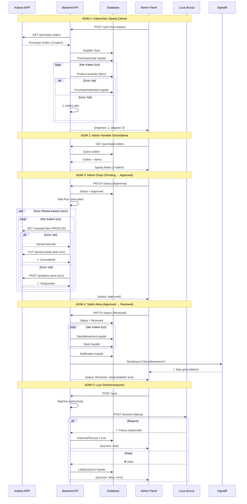
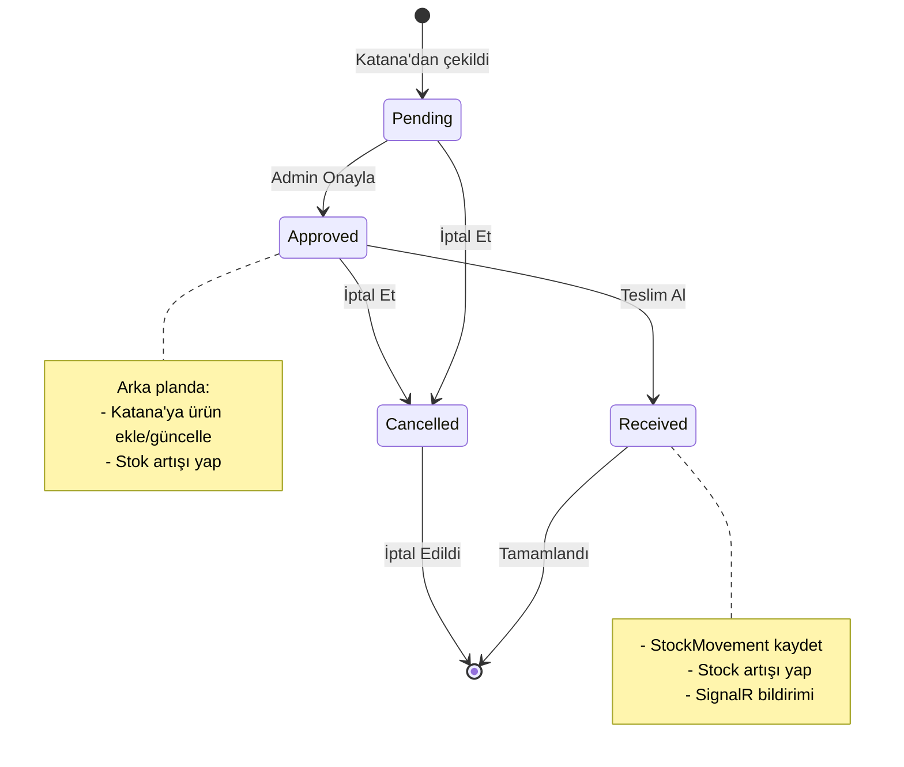

# SATIN ALMA SİPARİŞİ DETAYLI ANALİZ

## 📋 GENEL BAKIŞ

Bu dokümanda **Katana'dan satın alma siparişi oluşturulduğunda** sistemde nasıl bir akış izlediği, admin panelinde nasıl göründüğü, admin onayı sonrası stok artışının nasıl yapıldığı ve yeni ürün oluşturma mantığı detaylı olarak açıklanmaktadır.

---

## 🎯 SENARYO: SATIN ALMA SİPARİŞİ AKIŞI

### Başlangıç Durumu

```
Katana'da bir tedarikçiden 3 ürün için satın alma siparişi oluşturuldu:
- Ürün A (SKU: PROD-001): 50 adet
- Ürün B (SKU: PROD-002): 30 adet
- Ürün C (SKU: PROD-999): 20 adet (Bu ürün sistemde YOK!)
```

---

## 🔄 ADIM 1: KATANA'DAN SİPARİŞ ÇEKME

### Endpoint

```http
POST /api/purchase-orders/sync-from-katana?status=all&fromDate=2024-01-01
```

### Sorumlu Metod

`PurchaseOrdersController.SyncFromKatana()`

### İşleyiş Detayı

```csharp
1. Supplier Senkronizasyonu (Önce tedarikçiler çekilir)
   var supplierSyncCount = await _supplierService.SyncFromKatanaAsync();
   // Katana'daki tüm supplier'lar sisteme aktarılır

2. Katana'dan Purchase Order Çekme
   var katanaOrders = await _katanaService.GetPurchaseOrdersAsync(status, fromDate);
   // Örnek: 1 adet purchase order geldi (ID: 12345)

3. Her Sipariş İçin İşlem
   foreach (var katanaOrder in katanaOrders)
   {
       // A. Duplicate Kontrolü
       var existing = await _context.PurchaseOrders
           .FirstOrDefaultAsync(p => p.KatanaPurchaseOrderId == katanaOrder.Id);

       // B. Supplier Eşleştirme
       var supplier = await _context.Suppliers
           .FirstOrDefaultAsync(s => s.KatanaId == katanaOrder.SupplierCode);

       // Supplier yoksa placeholder oluştur
       if (supplier == null) {
           supplier = new Supplier {
               KatanaId = katanaOrder.SupplierCode,
               Name = $"Katana Supplier {katanaOrder.SupplierCode}",
               IsActive = true
           };
           _context.Suppliers.Add(supplier);
           await _context.SaveChangesAsync();
       }

       // C. Yeni Purchase Order Oluştur
       var newOrder = new PurchaseOrder {
           KatanaPurchaseOrderId = katanaOrder.Id,
           OrderNo = $"KAT-{katanaOrder.Id}",
           SupplierId = supplier.Id,
           SupplierCode = supplier.Code,
           KatanaSupplierId = katanaOrder.SupplierCode,
           Status = MapKatanaStatus(katanaOrder.Status), // "open" -> Pending
           OrderDate = katanaOrder.OrderDate,
           TotalAmount = katanaOrder.Items.Sum(i => i.TotalAmount),
           IsSynced = false,
           IsSyncedToLuca = false
       };

       // D. Sipariş Kalemlerini Ekle
       foreach (var katanaItem in katanaOrder.Items)
       {
           // SKU ile product bul
           var product = await _context.Products
               .FirstOrDefaultAsync(p => p.SKU == katanaItem.ProductSKU);

           if (product == null) {
               _logger.LogWarning("⚠️ Ürün bulunamadı (SKU: {SKU}), item atlanıyor",
                   katanaItem.ProductSKU);
               continue; // ⚠️ Ürün yoksa kalem atlanır!
           }

           var item = new PurchaseOrderItem {
               ProductId = product.Id,
               Quantity = katanaItem.Quantity,
               UnitPrice = katanaItem.UnitPrice,
               LucaStockCode = product.SKU,
               WarehouseCode = "01",
               VatRate = 20,
               UnitCode = "AD",
               DiscountAmount = 0
           };
           newOrder.Items.Add(item);
       }

       _context.PurchaseOrders.Add(newOrder);
   }

   await _context.SaveChangesAsync();
```

### Sonuç

```json
{
  "message": "Katana senkronizasyonu tamamlandı",
  "imported": 1,
  "updated": 0,
  "skipped": 0,
  "total": 1,
  "suppliersSynced": 5
}
```

### ⚠️ ÖNEMLİ NOT

**Bu aşamada PROD-999 (Ürün C) için kalem oluşturulmaz!** Çünkü sistemde bu SKU'ya sahip ürün yok ve `sync-from-katana` işlemi otomatik ürün oluşturmaz.

### Veritabanı Durumu

```sql
-- PurchaseOrders tablosu
INSERT INTO PurchaseOrders (
    OrderNo, KatanaPurchaseOrderId, SupplierId, Status, TotalAmount, OrderDate
) VALUES (
    'KAT-12345', '12345', 5, 'Pending', 8500.00, '2024-01-15'
);

-- PurchaseOrderItems tablosu (Sadece 2 kalem!)
INSERT INTO PurchaseOrderItems (PurchaseOrderId, ProductId, Quantity, UnitPrice)
VALUES
    (1, 101, 50, 100.00),  -- PROD-001
    (1, 102, 30, 150.00);  -- PROD-002
    -- PROD-999 YOK!
```

---

## 📊 ADIM 2: ADMİN PANELİNDE GÖRÜNTÜLEME

### Frontend Component

`frontend/katana-web/src/components/Admin/PurchaseOrders.tsx`

### Görünen Bilgiler

```
┌─────────────────────────────────────────────────────────────┐
│ Satın Alma Siparişleri                                      │
├─────────────────────────────────────────────────────────────┤
│ Sipariş No: KAT-12345                                       │
│ Tedarikçi: ABC Tedarik Ltd.                                 │
│ Durum: 🟡 Pending                                           │
│ Tarih: 15.01.2024                                           │
│ Toplam: 8,500.00 TL                                         │
│                                                              │
│ Kalemler:                                                    │
│  • PROD-001: 50 adet x 100.00 TL = 5,000.00 TL             │
│  • PROD-002: 30 adet x 150.00 TL = 4,500.00 TL             │
│                                                              │
│ ⚠️ UYARI: Katana'da 3 kalem var ama sistemde 2 kalem!      │
│                                                              │
│ [Onayla] [Kozaya Senkronize Et]                            │
└─────────────────────────────────────────────────────────────┘
```

### Admin Aksiyonları

1. **Durum Güncelleme**: Pending → Approved → Received
2. **Kozaya Senkronize Et**: Luca'ya fatura olarak gönder

---

## ✅ ADIM 3: ADMİN ONAYI (Pending → Approved)

### Endpoint

```http
PATCH /api/purchase-orders/{id}/status
Content-Type: application/json

{
  "newStatus": "Approved"
}
```

### Sorumlu Metod

`PurchaseOrdersController.UpdateStatus()`

### İşleyiş Detayı (KRİTİK!)

```csharp
// 1. Durum Geçiş Kontrolü
var isValidTransition = StatusMapper.IsValidTransition(order.Status, request.NewStatus);
// Pending -> Approved: ✅ Geçerli

// 2. Durum Güncelleme
var oldStatus = order.Status;
order.Status = request.NewStatus; // Approved
order.UpdatedAt = DateTime.UtcNow;

// 3. 🔥 KRİTİK: "Approved" durumuna geçildiğinde KATANA'YA ÜRÜN EKLE/GÜNCELLE
if (request.NewStatus == PurchaseOrderStatus.Approved && oldStatus != PurchaseOrderStatus.Approved)
{
    _logger.LogInformation("✅ Sipariş onaylandı, Katana'ya ürünler ekleniyor/güncelleniyor");

    // ⚠️ ARKA PLANDA (Task.Run) çalışır - asenkron!
    _ = Task.Run(async () =>
    {
        await Task.Delay(1000); // 1 saniye bekle (DB commit olsun)

        foreach (var item in order.Items)
        {
            if (item.Product == null) {
                _logger.LogWarning("⚠️ Ürün bulunamadı: ProductId={ProductId}, atlanıyor",
                    item.ProductId);
                continue;
            }

            try
            {
                // A. Katana'da ürün var mı kontrol et
                var existingProduct = await _katanaService.GetProductBySkuAsync(item.Product.SKU);

                if (existingProduct != null)
                {
                    // ✅ ÜRÜN VAR: Stok güncelle
                    _logger.LogInformation("🔄 Katana'da ürün bulundu, güncelleniyor: {SKU}",
                        item.Product.SKU);

                    if (!int.TryParse(existingProduct.Id, out var katanaProductId)) {
                        _logger.LogWarning("⚠️ Katana ürün ID sayısal değil: {Id}, SKU={SKU}",
                            existingProduct.Id, item.Product.SKU);
                        continue;
                    }

                    // Yeni stok = Mevcut stok + Sipariş miktarı
                    var newStock = (existingProduct.InStock ?? 0) + item.Quantity;

                    var updated = await _katanaService.UpdateProductAsync(
                        katanaProductId,
                        existingProduct.Name,
                        existingProduct.SalesPrice,
                        (int)newStock
                    );

                    if (updated) {
                        _logger.LogInformation("✅ Katana ürün güncellendi: {SKU}, Yeni Stok: {Stock}",
                            item.Product.SKU, newStock);
                    }
                }
                else
                {
                    // ➕ ÜRÜN YOK: Yeni ürün oluştur
                    _logger.LogInformation("➕ Katana'da ürün yok, oluşturuluyor: {SKU}",
                        item.Product.SKU);

                    var newProduct = new KatanaProductDto {
                        Name = item.Product.Name,
                        SKU = item.Product.SKU,
                        SalesPrice = item.UnitPrice,
                        InStock = item.Quantity,
                        Description = item.Product.Description,
                        IsActive = true
                    };

                    var created = await _katanaService.CreateProductAsync(newProduct);

                    if (created != null) {
                        _logger.LogInformation("✅ Katana ürün oluşturuldu: {SKU}, Stok: {Stock}",
                            item.Product.SKU, item.Quantity);
                    } else {
                        _logger.LogWarning("⚠️ Katana ürün oluşturulamadı: {SKU}",
                            item.Product.SKU);
                    }
                }
            }
            catch (Exception itemEx)
            {
                _logger.LogError(itemEx, "❌ Katana ürün sync hatası: {SKU}", item.Product.SKU);
            }
        }

        _logger.LogInformation("✅ Katana ürün sync tamamlandı: {OrderNo}", order.OrderNo);
    });
}

// 4. Veritabanı Kaydet
await _context.SaveChangesAsync();

// 5. Audit Log
_auditService.LogUpdate(
    "PurchaseOrder",
    id.ToString(),
    User.Identity?.Name ?? "System",
    $"Status: {oldStatus} -> {request.NewStatus}",
    "Sipariş durumu güncellendi"
);
```

### Katana API Çağrıları

#### A. Ürün Kontrolü

```http
GET /api/v1/variants?sku=PROD-001
Authorization: Bearer {katana_api_key}

Response:
{
  "id": "456",
  "sku": "PROD-001",
  "name": "Ürün A",
  "in_stock": 100,
  "sales_price": 100.00
}
```

#### B. Ürün Güncelleme (Stok Artışı)

```http
PUT /api/v1/products/456
Authorization: Bearer {katana_api_key}
Content-Type: application/json

{
  "name": "Ürün A",
  "sales_price": 100.00,
  "in_stock": 150  // 100 + 50 = 150
}
```

#### C. Yeni Ürün Oluşturma (Ürün yoksa)

```http
POST /api/v1/products
Authorization: Bearer {katana_api_key}
Content-Type: application/json

{
  "name": "Ürün A",
  "sku": "PROD-001",
  "sales_price": 100.00,
  "in_stock": 50,
  "unit": "pcs",
  "is_active": true
}
```

### Senaryo Sonucu

```
Sipariş: KAT-12345
Durum: Pending → Approved ✅

Katana'ya Gönderilen İşlemler:
1. PROD-001 (Ürün A):
   - Katana'da VAR
   - Mevcut stok: 100
   - Sipariş: +50
   - Yeni stok: 150 ✅

2. PROD-002 (Ürün B):
   - Katana'da VAR
   - Mevcut stok: 200
   - Sipariş: +30
   - Yeni stok: 230 ✅
```

### ⚠️ ÖNEMLİ NOTLAR

1. **Asenkron İşlem**: Katana'ya ürün ekleme/güncelleme arka planda çalışır (`Task.Run`)
2. **Hata Toleransı**: Bir ürün başarısız olsa bile diğerleri işlenir
3. **Yeni Ürün**: Katana'da ürün yoksa otomatik oluşturulur
4. **Stok Artışı**: Mevcut stok + sipariş miktarı
5. **Geri Alınamaz**: Onay işlemi geri alınamaz!

---

## 📦 ADIM 4: TESLİM ALMA (Approved → Received)

### Endpoint

```http
PATCH /api/purchase-orders/{id}/status
Content-Type: application/json

{
  "newStatus": "Received"
}
```

### İşleyiş Detayı

```csharp
// 🔥 KRİTİK: "Received" durumuna geçildiğinde STOK ARTIŞI yap
if (request.NewStatus == PurchaseOrderStatus.Received && oldStatus != PurchaseOrderStatus.Received)
{
    _logger.LogInformation("📦 Sipariş teslim alındı, stok artışı yapılıyor");

    var stockMovements = new List<object>();

    foreach (var item in order.Items)
    {
        if (item.Product == null) continue;

        // 1. StockMovement kaydı oluştur
        var movement = new StockMovement {
            ProductId = item.ProductId,
            ProductSku = item.Product.SKU,
            ChangeQuantity = item.Quantity, // Pozitif miktar (giriş)
            MovementType = MovementType.In,
            SourceDocument = $"PO-{order.OrderNo}",
            Timestamp = DateTime.UtcNow,
            WarehouseCode = item.WarehouseCode ?? "MAIN",
            IsSynced = false
        };
        _context.StockMovements.Add(movement);

        // 2. Stock kaydı oluştur
        var stockEntry = new Stock {
            ProductId = item.ProductId,
            Location = item.WarehouseCode ?? "MAIN",
            Quantity = item.Quantity,
            Type = "IN",
            Reason = $"Satınalma siparişi teslim alındı: {order.OrderNo}",
            Reference = order.OrderNo,
            Timestamp = DateTime.UtcNow,
            IsSynced = false
        };
        _context.Stocks.Add(stockEntry);

        stockMovements.Add(new {
            sku = item.Product.SKU,
            quantity = item.Quantity,
            warehouse = item.WarehouseCode ?? "MAIN"
        });

        _logger.LogInformation("✅ Stok artışı: {SKU} +{Qty} ({Warehouse})",
            item.Product.SKU, item.Quantity, item.WarehouseCode ?? "MAIN");
    }

    // 3. Bildirim Oluştur
    var notification = new Notification {
        Type = "StockMovement",
        Title = $"Stok Girişi: {order.OrderNo}",
        Payload = JsonSerializer.Serialize(new {
            orderNo = order.OrderNo,
            orderId = order.Id,
            itemCount = stockMovements.Count,
            movements = stockMovements
        }),
        Link = $"/purchase-orders/{order.Id}",
        IsRead = false,
        CreatedAt = DateTime.UtcNow
    };
    _context.Notifications.Add(notification);

    // 4. SignalR Bildirimi
    await _hubContext.Clients.All.SendAsync("StockMovement", new {
        orderNo = order.OrderNo,
        orderId = order.Id,
        itemCount = stockMovements.Count,
        message = $"Stok girişi yapıldı: {order.OrderNo} ({stockMovements.Count} kalem)"
    });
}

await _context.SaveChangesAsync();
```

### Veritabanı Değişiklikleri

```sql
-- StockMovements tablosu
INSERT INTO StockMovements (ProductId, ProductSku, ChangeQuantity, MovementType, SourceDocument, WarehouseCode)
VALUES
    (101, 'PROD-001', 50, 'In', 'PO-KAT-12345', 'MAIN'),
    (102, 'PROD-002', 30, 'In', 'PO-KAT-12345', 'MAIN');

-- Stocks tablosu
INSERT INTO Stocks (ProductId, Location, Quantity, Type, Reason, Reference)
VALUES
    (101, 'MAIN', 50, 'IN', 'Satınalma siparişi teslim alındı: KAT-12345', 'KAT-12345'),
    (102, 'MAIN', 30, 'IN', 'Satınalma siparişi teslim alındı: KAT-12345', 'KAT-12345');

-- Notifications tablosu
INSERT INTO Notifications (Type, Title, Payload, Link, IsRead)
VALUES (
    'StockMovement',
    'Stok Girişi: KAT-12345',
    '{"orderNo":"KAT-12345","orderId":1,"itemCount":2,"movements":[...]}',
    '/purchase-orders/1',
    0
);

-- PurchaseOrders tablosu
UPDATE PurchaseOrders
SET Status = 'Received', UpdatedAt = GETUTCDATE()
WHERE Id = 1;
```

### SignalR Bildirimi

Admin panelinde gerçek zamanlı bildirim:

```javascript
// frontend/katana-web/src/services/signalr.ts
connection.on("StockMovement", (data) => {
  toast.success(
    `Stok girişi yapıldı: ${data.orderNo} (${data.itemCount} kalem)`
  );
  // Stok listesini yenile
  refreshStockList();
});
```

---

## 🔄 ADIM 5: KOZAYA SENKRONİZE ET (Luca Entegrasyonu)

### Endpoint

```http
POST /api/purchase-orders/{id}/sync
```

### Sorumlu Metod

`PurchaseOrdersController.SyncToLuca()`

### İşleyiş Detayı

```csharp
// 1. Sipariş Kontrolü
var order = await _context.PurchaseOrders
    .Include(p => p.Supplier)
    .Include(p => p.Items)
        .ThenInclude(i => i.Product)
    .FirstOrDefaultAsync(p => p.Id == id);

if (order.Supplier == null) {
    return BadRequest(new { message = "Tedarikçi bilgisi eksik" });
}

// 2. Luca FATURA Request Hazırlama
// ⚠️ ÖNEMLİ: Satınalma siparişi FATURA olarak gönderilir!
var lucaInvoiceRequest = MappingHelper.MapToLucaInvoiceFromPurchaseOrder(order, order.Supplier);

// Mapping içeriği:
// {
//   "belgeSeri": "A",
//   "belgeNo": "KAT-12345",
//   "cariId": 123,
//   "belgeTarihi": "2024-01-15",
//   "duzenlemeSaati": "10:30:00",
//   "kdvFlag": true,
//   "ozelKod": "KAT-PO-12345",
//   "satirlar": [
//     {
//       "stokId": 456,
//       "miktar": 50,
//       "birimFiyat": 100.00,
//       "kdvOrani": 20,
//       "depoKodu": "01",
//       "birimKodu": "AD"
//     },
//     {
//       "stokId": 789,
//       "miktar": 30,
//       "birimFiyat": 150.00,
//       "kdvOrani": 20,
//       "depoKodu": "01",
//       "birimKodu": "AD"
//     }
//   ]
// }

_logger.LogInformation("📤 Fatura gönderiliyor: {OrderNo}", order.OrderNo);

// 3. Luca API Çağrısı
var syncResult = await _lucaService.SendInvoiceAsync(lucaInvoiceRequest);

// 4. Response İşleme
if (syncResult.IsSuccess)
{
    // ✅ Başarılı
    order.IsSyncedToLuca = true;
    order.LastSyncAt = DateTime.UtcNow;
    order.LastSyncError = null;
    order.SyncRetryCount = 0;
    order.UpdatedAt = DateTime.UtcNow;

    await _context.SaveChangesAsync();

    _auditService.LogSync(
        "PurchaseOrderInvoiceSync",
        User.Identity?.Name ?? "System",
        $"Luca'ya fatura olarak başarıyla senkronize edildi: {order.OrderNo}"
    );

    return Ok(new PurchaseOrderSyncResultDto {
        Success = true,
        LucaPurchaseOrderId = null,
        LucaDocumentNo = order.OrderNo,
        Message = "Fatura başarıyla Luca'ya aktarıldı"
    });
}
else
{
    // ❌ Başarısız
    var errorMessage = syncResult.Message ?? "Bilinmeyen hata";

    order.LastSyncError = errorMessage;
    order.SyncRetryCount++;
    order.UpdatedAt = DateTime.UtcNow;
    await _context.SaveChangesAsync();

    return Ok(new PurchaseOrderSyncResultDto {
        Success = false,
        Message = errorMessage
    });
}
```

### Luca API Çağrısı

```http
POST https://luca-api.example.com/api/invoices
Authorization: Bearer {luca_token}
Content-Type: application/json

{
  "belgeSeri": "A",
  "belgeNo": "KAT-12345",
  "cariId": 123,
  "belgeTarihi": "2024-01-15T00:00:00Z",
  "duzenlemeSaati": "10:30:00",
  "kdvFlag": true,
  "ozelKod": "KAT-PO-12345",
  "satirlar": [
    {
      "stokId": 456,
      "miktar": 50,
      "birimFiyat": 100.00,
      "kdvOrani": 20,
      "depoKodu": "01",
      "birimKodu": "AD"
    },
    {
      "stokId": 789,
      "miktar": 30,
      "birimFiyat": 150.00,
      "kdvOrani": 20,
      "depoKodu": "01",
      "birimKodu": "AD"
    }
  ]
}
```

### Başarılı Response

```json
{
  "success": true,
  "lucaPurchaseOrderId": null,
  "lucaDocumentNo": "KAT-12345",
  "message": "Fatura başarıyla Luca'ya aktarıldı"
}
```

### Hata Response

```json
{
  "success": false,
  "message": "Luca API hatası: Tedarikçi bulunamadı (CariId: 123)"
}
```

---

## 📊 DURUM GEÇİŞ DİYAGRAMI

```
┌─────────┐
│ Pending │ (Katana'dan çekildi)
└────┬────┘
     │
     │ [Admin Onayla]
     │ → Katana'ya ürün ekle/güncelle (arka planda)
     ▼
┌─────────┐
│Approved │
└────┬────┘
     │
     │ [Teslim Al]
     │ → StockMovement kayıtları oluştur
     │ → Stock artışı yap
     │ → SignalR bildirimi gönder
     ▼
┌─────────┐
│Received │
└────┬────┘
     │
     │ [Kozaya Senkronize Et]
     │ → Luca'ya fatura olarak gönder
     ▼
┌─────────────────┐
│ Luca'ya Aktarıldı│
└─────────────────┘
```

### Alternatif Akış: İptal

```
┌─────────┐
│ Pending │
└────┬────┘
     │
     │ [İptal Et]
     ▼
┌───────────┐
│ Cancelled │
└───────────┘
```

---

## 🎯 ÖZET: SATIN ALMA SİPARİŞİ AKIŞI

### 1. Katana'dan Çekme

- **Endpoint**: `POST /api/purchase-orders/sync-from-katana`
- **Sonuç**: PurchaseOrders ve PurchaseOrderItems tablolarına kayıt
- **Durum**: Pending
- **⚠️ Not**: Sistemde olmayan ürünler için kalem oluşturulmaz!

### 2. Admin Panelde Görüntüleme

- **Component**: `PurchaseOrders.tsx`
- **Bilgiler**: Sipariş no, tedarikçi, kalemler, toplam tutar
- **Aksiyonlar**: Onayla, Kozaya Senkronize Et

### 3. Admin Onayı (Pending → Approved)

- **Endpoint**: `PATCH /api/purchase-orders/{id}/status`
- **İşlem**: Katana'ya ürün ekleme/güncelleme (arka planda)
- **Yeni Ürün**: Katana'da yoksa otomatik oluşturulur
- **Stok Artışı**: Mevcut stok + sipariş miktarı

### 4. Teslim Alma (Approved → Received)

- **Endpoint**: `PATCH /api/purchase-orders/{id}/status`
- **İşlem**:
  - StockMovement kayıtları oluştur
  - Stock artışı yap
  - SignalR bildirimi gönder
- **Sonuç**: Stok fiziksel olarak sisteme girer

### 5. Kozaya Senkronize Et

- **Endpoint**: `POST /api/purchase-orders/{id}/sync`
- **İşlem**: Luca'ya fatura olarak gönder
- **Format**: Satınalma faturası
- **Sonuç**: IsSyncedToLuca = true

---

## 🔥 KRİTİK NOKTALAR

### 1. Yeni Ürün Oluşturma

```
❓ Soru: Sistemde olmayan bir ürün için sipariş gelirse ne olur?

✅ Cevap:
- sync-from-katana: Kalem atlanır (ürün oluşturulmaz)
- Admin Onayı: Katana'ya yeni ürün oluşturulur (arka planda)
- Teslim Alma: Stok hareketi oluşturulmaz (ürün yok)

💡 Çözüm: Önce ürünleri sisteme ekleyin, sonra siparişi çekin!
```

### 2. Stok Artışı Zamanlaması

```
Approved: Katana'da stok artar (arka planda)
Received: Sistemde stok artar (StockMovement + Stock)

⚠️ İki farklı stok sistemi!
```

### 3. Asenkron İşlemler

```
Admin Onayı → Katana sync: Task.Run() (arka planda)
- Hata olsa bile sipariş onaylanır
- Loglar kontrol edilmeli
```

### 4. Geri Alınamaz İşlemler

```
❌ Onay geri alınamaz
❌ Teslim alma geri alınamaz
❌ Luca senkronizasyonu geri alınamaz

⚠️ Dikkatli olun!
```

---

## 📝 ÖRNEK SENARYO: BAŞTAN SONA

### Başlangıç

```
Katana'da satın alma siparişi oluşturuldu:
- Sipariş No: PO-2024-001
- Tedarikçi: ABC Tedarik Ltd.
- Kalemler:
  * PROD-001 (Ürün A): 50 adet x 100 TL = 5,000 TL
  * PROD-002 (Ürün B): 30 adet x 150 TL = 4,500 TL
  * PROD-999 (Ürün C): 20 adet x 200 TL = 4,000 TL (YENİ ÜRÜN!)
- Toplam: 13,500 TL
```

### Adım 1: Katana'dan Çekme

```bash
POST /api/purchase-orders/sync-from-katana

Response:
{
  "imported": 1,
  "skipped": 0,
  "total": 1
}

⚠️ PROD-999 için kalem oluşturulmadı (ürün sistemde yok)
```

### Adım 2: Admin Panelde Görüntüleme

```
Sipariş: KAT-PO-2024-001
Durum: 🟡 Pending
Kalemler: 2 adet (PROD-001, PROD-002)
Toplam: 9,500 TL

⚠️ Katana'da 3 kalem var ama sistemde 2 kalem!
```

### Adım 3: Admin Onayı

```bash
PATCH /api/purchase-orders/1/status
{
  "newStatus": "Approved"
}

Response:
{
  "message": "Sipariş durumu güncellendi",
  "oldStatus": "Pending",
  "newStatus": "Approved",
  "stockUpdated": false
}

Arka Planda (1 saniye sonra):
1. PROD-001: Katana'da VAR → Stok güncellendi (100 → 150) ✅
2. PROD-002: Katana'da VAR → Stok güncellendi (200 → 230) ✅

Loglar:
[INFO] ✅ Sipariş onaylandı, Katana'ya ürünler ekleniyor/güncelleniyor
[INFO] 🔄 Katana'da ürün bulundu, güncelleniyor: PROD-001
[INFO] ✅ Katana ürün güncellendi: PROD-001, Yeni Stok: 150
[INFO] 🔄 Katana'da ürün bulundu, güncelleniyor: PROD-002
[INFO] ✅ Katana ürün güncellendi: PROD-002, Yeni Stok: 230
[INFO] ✅ Katana ürün sync tamamlandı: KAT-PO-2024-001
```

### Adım 4: Teslim Alma

```bash
PATCH /api/purchase-orders/1/status
{
  "newStatus": "Received"
}

Response:
{
  "message": "Sipariş durumu güncellendi",
  "oldStatus": "Approved",
  "newStatus": "Received",
  "stockUpdated": true
}

Veritabanı Değişiklikleri:
- StockMovements: 2 kayıt eklendi
- Stocks: 2 kayıt eklendi
- Notifications: 1 bildirim oluşturuldu

SignalR Bildirimi:
"Stok girişi yapıldı: KAT-PO-2024-001 (2 kalem)"
```

### Adım 5: Kozaya Senkronize Et

```bash
POST /api/purchase-orders/1/sync

Response:
{
  "success": true,
  "lucaDocumentNo": "KAT-PO-2024-001",
  "message": "Fatura başarıyla Luca'ya aktarıldı"
}

Luca'ya Gönderilen Fatura:
- Belge No: KAT-PO-2024-001
- Tedarikçi: ABC Tedarik Ltd. (CariId: 123)
- Kalemler:
  * PROD-001: 50 adet x 100 TL
  * PROD-002: 30 adet x 150 TL
- Toplam: 9,500 TL (KDV dahil)
```

### Son Durum

```
Sipariş: KAT-PO-2024-001
Durum: ✅ Received
Luca Sync: ✅ Senkronize Edildi
Katana Stok: ✅ Güncellendi
Sistem Stok: ✅ Artırıldı

Katana Stokları:
- PROD-001: 100 → 150 (+50)
- PROD-002: 200 → 230 (+30)

Sistem Stokları:
- PROD-001: +50 (StockMovement + Stock)
- PROD-002: +30 (StockMovement + Stock)

⚠️ PROD-999 hiçbir yerde işlenmedi (ürün sistemde yok)
```

---

## 🛠️ SORUN GİDERME

### Problem 1: Ürün Sistemde Yok

```
Hata: "⚠️ Ürün bulunamadı (SKU: PROD-999), item atlanıyor"

Çözüm:
1. Önce ürünü sisteme ekleyin:
   POST /api/products
   {
     "name": "Ürün C",
     "sku": "PROD-999",
     "price": 200.00
   }

2. Siparişi tekrar çekin:
   POST /api/purchase-orders/sync-from-katana
```

### Problem 2: Katana Sync Başarısız

```
Hata: "❌ Katana ürün sync hatası: PROD-001"

Kontrol:
1. Katana API key geçerli mi?
2. Katana'da ürün var mı?
3. Logları kontrol edin:
   GET /api/logs?search=Katana+ürün+sync
```

### Problem 3: Luca Sync Başarısız

```
Hata: "Luca API hatası: Tedarikçi bulunamadı (CariId: 123)"

Çözüm:
1. Tedarikçi Luca'da var mı kontrol edin
2. CariId doğru mu?
3. Luca session geçerli mi?
4. Retry:
   POST /api/purchase-orders/retry-failed
```

### Problem 4: Stok Artmadı

```
Durum: Received ama stok artmadı

Kontrol:
1. StockMovements tablosunu kontrol edin:
   SELECT * FROM StockMovements WHERE SourceDocument = 'PO-KAT-12345'

2. Stocks tablosunu kontrol edin:
   SELECT * FROM Stocks WHERE Reference = 'KAT-12345'

3. Logları kontrol edin:
   GET /api/logs?search=Stok+artışı
```

---

## 📚 İLGİLİ DOSYALAR

### Backend

- `src/Katana.API/Controllers/PurchaseOrdersController.cs` - Ana controller
- `src/Katana.Core/Entities/PurchaseOrder.cs` - Entity tanımı
- `src/Katana.Core/Entities/PurchaseOrderItem.cs` - Kalem entity
- `src/Katana.Core/Enums/PurchaseOrderStatus.cs` - Durum enum
- `src/Katana.Infrastructure/APIClients/KatanaService.cs` - Katana API client
- `src/Katana.Infrastructure/APIClients/LucaService.cs` - Luca API client
- `src/Katana.Core/Helpers/MappingHelper.cs` - DTO mapping

### Frontend

- `frontend/katana-web/src/components/Admin/PurchaseOrders.tsx` - Ana component
- `frontend/katana-web/src/components/Admin/PurchaseOrders/StatusBadge.tsx` - Durum badge
- `frontend/katana-web/src/components/Admin/PurchaseOrders/StatusActions.tsx` - Aksiyon butonları
- `frontend/katana-web/src/services/signalr.ts` - SignalR client

### Dokümanlar

- `ADMIN_SIPARIS_ONAY_VE_KOZA_SENKRONIZASYON_AKISI.md` - Genel akış
- `KATANA_SIPARIS_AKISI_DETAYLI_RAPOR.md` - Satış siparişi akışı
- `STOK_KARTI_OLUSTURMA_MIMARI_RAPOR.md` - Stok kartı oluşturma

---

## 🎓 SONUÇ

Satın alma siparişi akışı 5 ana adımdan oluşur:

1. **Katana'dan Çekme**: Siparişler otomatik veya manuel çekilir
2. **Admin Görüntüleme**: Admin panelde sipariş detayları görüntülenir
3. **Admin Onayı**: Katana'ya ürün ekleme/güncelleme (arka planda)
4. **Teslim Alma**: Sisteme stok girişi yapılır
5. **Luca Senkronizasyonu**: Fatura olarak Luca'ya gönderilir

### Kritik Noktalar

- ✅ Yeni ürünler admin onayında Katana'ya eklenir
- ✅ Stok artışı teslim almada yapılır
- ✅ Luca'ya fatura olarak gönderilir
- ⚠️ Sistemde olmayan ürünler için kalem oluşturulmaz
- ⚠️ Tüm işlemler geri alınamaz

### Öneriler

1. Önce ürünleri sisteme ekleyin
2. Sonra siparişleri çekin
3. Logları düzenli kontrol edin
4. Hata durumlarında retry kullanın

---

**Son Güncelleme**: 2024-12-14  
**Versiyon**: 1.0  
**Hazırlayan**: Kiro AI Assistant

---

## 📊 GÖRSEL AKIŞ DİYAGRAMI

### Tam Akış (Mermaid)



### Durum Geçiş Diyagramı



### Veri Akış Diyagramı

```mermaid
flowchart TD
    Start([Katana Purchase Order]) --> Sync[Sync From Katana]

    Sync --> CheckSupplier{Supplier<br/>Var mı?}
    CheckSupplier -->|Hayır| CreateSupplier[Placeholder<br/>Supplier Oluştur]
    CheckSupplier -->|Evet| CreateOrder[PurchaseOrder<br/>Oluştur]
    CreateSupplier --> CreateOrder

    CreateOrder --> LoopItems[Her Kalem İçin]
    LoopItems --> CheckProduct{Product<br/>Var mı?}
    CheckProduct -->|Hayır| SkipItem[⚠️ Kalem Atla]
    CheckProduct -->|Evet| CreateItem[PurchaseOrderItem<br/>Oluştur]

    SkipItem --> NextItem{Başka<br/>Kalem?}
    CreateItem --> NextItem
    NextItem -->|Evet| LoopItems
    NextItem -->|Hayır| SaveDB[(Database<br/>Kaydet)]

    SaveDB --> AdminView[Admin Panel<br/>Görüntüleme]

    AdminView --> Approve{Admin<br/>Onayla?}
    Approve -->|Hayır| Wait[Bekle]
    Wait --> AdminView

    Approve -->|Evet| UpdateStatus[Status = Approved]
    UpdateStatus --> KatanaSync[Arka Planda<br/>Katana Sync]

    KatanaSync --> LoopKatana[Her Kalem İçin]
    LoopKatana --> CheckKatanaProduct{Katana'da<br/>Ürün Var?}
    CheckKatanaProduct -->|Evet| UpdateKatana[Stok Güncelle]
    CheckKatanaProduct -->|Hayır| CreateKatana[Yeni Ürün<br/>Oluştur]

    UpdateKatana --> NextKatana{Başka<br/>Kalem?}
    CreateKatana --> NextKatana
    NextKatana -->|Evet| LoopKatana
    NextKatana -->|Hayır| Receive{Teslim<br/>Al?}

    Receive -->|Hayır| WaitReceive[Bekle]
    WaitReceive --> Receive

    Receive -->|Evet| UpdateReceived[Status = Received]
    UpdateReceived --> CreateMovement[StockMovement<br/>Oluştur]
    CreateMovement --> CreateStock[Stock<br/>Oluştur]
    CreateStock --> Notify[SignalR<br/>Bildirimi]

    Notify --> LucaSync{Luca'ya<br/>Gönder?}
    LucaSync -->|Hayır| End([Tamamlandı])

    LucaSync -->|Evet| MapInvoice[Fatura<br/>Mapping]
    MapInvoice --> SendLuca[Luca API<br/>Çağrısı]
    SendLuca --> CheckLuca{Başarılı?}
    CheckLuca -->|Evet| MarkSynced[IsSyncedToLuca<br/>= true]
    CheckLuca -->|Hayır| LogError[LastSyncError<br/>Kaydet]

    MarkSynced --> End
    LogError --> End

    style Start fill:#e1f5ff
    style End fill:#c8e6c9
    style SkipItem fill:#ffebee
    style LogError fill:#ffebee
    style CreateKatana fill:#fff9c4
    style UpdateKatana fill:#fff9c4
    style Notify fill:#e1bee7
```



### Katana Ürün Sync Detayı

```mermaid
flowchart LR
    Start([Sipariş Onaylandı]) --> Loop[Her Kalem İçin]

    Loop --> GetProduct[Product Bilgisi Al]
    GetProduct --> CheckNull{Product<br/>null?}
    CheckNull -->|Evet| Skip[⚠️ Atla]
    CheckNull -->|Hayır| SearchKatana[Katana'da<br/>SKU Ara]

    SearchKatana --> Found{Bulundu?}

    Found -->|Evet| GetStock[Mevcut Stok Al]
    GetStock --> CalcNew[Yeni Stok Hesapla<br/>mevcut + sipariş]
    CalcNew --> Update[PUT /products/{id}]
    Update --> LogUpdate[✅ Log: Güncellendi]

    Found -->|Hayır| PrepareNew[Yeni Ürün DTO<br/>Hazırla]
    PrepareNew --> Create[POST /products]
    Create --> CheckCreate{Başarılı?}
    CheckCreate -->|Evet| LogCreate[✅ Log: Oluşturuldu]
    CheckCreate -->|Hayır| LogFail[⚠️ Log: Başarısız]

    Skip --> Next{Başka<br/>Kalem?}
    LogUpdate --> Next
    LogCreate --> Next
    LogFail --> Next

    Next -->|Evet| Loop
    Next -->|Hayır| End([Sync Tamamlandı])

    style Start fill:#e1f5ff
    style End fill:#c8e6c9
    style Skip fill:#ffebee
    style LogFail fill:#ffebee
    style LogCreate fill:#c8e6c9
    style LogUpdate fill:#c8e6c9
```

---

## 🔍 DETAYLI TABLO: İŞLEM ADIMLARI

| Adım         | Endpoint            | Metod | Durum Değişimi      | Katana               | Luca     | DB Değişikliği                                         |
| ------------ | ------------------- | ----- | ------------------- | -------------------- | -------- | ------------------------------------------------------ |
| 1. Sync      | `/sync-from-katana` | POST  | - → Pending         | ✅ Read              | -        | PurchaseOrders<br/>PurchaseOrderItems                  |
| 2. Görüntüle | `/purchase-orders`  | GET   | -                   | -                    | -        | -                                                      |
| 3. Onayla    | `/status`           | PATCH | Pending → Approved  | ✅ Write (arka plan) | -        | Status                                                 |
| 4. Teslim Al | `/status`           | PATCH | Approved → Received | -                    | -        | Status<br/>StockMovements<br/>Stocks<br/>Notifications |
| 5. Luca Sync | `/sync`             | POST  | -                   | -                    | ✅ Write | IsSyncedToLuca<br/>LastSyncAt                          |

---

## 📈 PERFORMANS METRİKLERİ

### Toplu İşlemler

```bash
# Tüm bekleyen siparişleri senkronize et
POST /api/purchase-orders/sync-all?maxCount=50

Response:
{
  "totalProcessed": 50,
  "successCount": 48,
  "failCount": 2,
  "durationMs": 12500,
  "rateOrdersPerMinute": 230.4,
  "errors": [...]
}
```

### Hatalı Siparişleri Yeniden Dene

```bash
# Maksimum 3 deneme yapılmış siparişleri tekrar dene
POST /api/purchase-orders/retry-failed?maxRetries=3

Response:
{
  "totalProcessed": 10,
  "successCount": 8,
  "failCount": 2,
  "durationMs": 5200,
  "rateOrdersPerMinute": 92.3,
  "errors": [...]
}
```

### Paralel İşleme

- **sync-all**: 5 eşzamanlı istek
- **retry-failed**: 3 eşzamanlı istek
- **Timeout**: Yok (infinite)

---

## 📚 API REFERANSI

### Purchase Orders Endpoints

#### 1. Katana'dan Senkronize Et

```http
POST /api/purchase-orders/sync-from-katana?status=all&fromDate=2024-01-01
Authorization: Bearer {token}

Response 200:
{
  "message": "Katana senkronizasyonu tamamlandı",
  "imported": 5,
  "updated": 2,
  "skipped": 1,
  "total": 7,
  "suppliersSynced": 3
}
```

#### 2. Tüm Siparişleri Listele

```http
GET /api/purchase-orders?page=1&pageSize=50&status=Pending&syncStatus=not_synced
Authorization: Bearer {token}

Response 200:
{
  "items": [
    {
      "id": 1,
      "orderNo": "KAT-12345",
      "supplierName": "ABC Tedarik Ltd.",
      "totalAmount": 8500.00,
      "status": "Pending",
      "isSyncedToLuca": false,
      "lastSyncError": null
    }
  ],
  "pagination": {
    "currentPage": 1,
    "pageSize": 50,
    "totalCount": 100,
    "totalPages": 2
  }
}
```

#### 3. Sipariş Detayı

```http
GET /api/purchase-orders/1
Authorization: Bearer {token}

Response 200:
{
  "id": 1,
  "orderNo": "KAT-12345",
  "supplierId": 5,
  "supplierName": "ABC Tedarik Ltd.",
  "status": "Pending",
  "totalAmount": 8500.00,
  "orderDate": "2024-01-15T00:00:00Z",
  "items": [
    {
      "id": 1,
      "productId": 101,
      "productName": "Ürün A",
      "productSku": "PROD-001",
      "quantity": 50,
      "unitPrice": 100.00
    }
  ],
  "isSyncedToLuca": false,
  "lastSyncError": null
}
```

#### 4. Durum Güncelle

```http
PATCH /api/purchase-orders/1/status
Authorization: Bearer {token}
Content-Type: application/json

{
  "newStatus": "Approved"
}

Response 200:
{
  "message": "Sipariş durumu güncellendi",
  "oldStatus": "Pending",
  "newStatus": "Approved",
  "stockUpdated": false
}
```

#### 5. Luca'ya Senkronize Et

```http
POST /api/purchase-orders/1/sync
Authorization: Bearer {token}

Response 200:
{
  "success": true,
  "lucaPurchaseOrderId": null,
  "lucaDocumentNo": "KAT-12345",
  "message": "Fatura başarıyla Luca'ya aktarıldı"
}
```

#### 6. Toplu Senkronizasyon

```http
POST /api/purchase-orders/sync-all?maxCount=50
Authorization: Bearer {token}

Response 200:
{
  "message": "50 sipariş işlendi",
  "totalProcessed": 50,
  "successCount": 48,
  "failCount": 2,
  "durationMs": 12500,
  "rateOrdersPerMinute": 230.4,
  "results": [...]
}
```

#### 7. Hatalıları Yeniden Dene

```http
POST /api/purchase-orders/retry-failed?maxRetries=3
Authorization: Bearer {token}

Response 200:
{
  "message": "10 hatalı sipariş yeniden denendi",
  "totalProcessed": 10,
  "successCount": 8,
  "failCount": 2,
  "durationMs": 5200,
  "rateOrdersPerMinute": 92.3,
  "results": [...]
}
```

#### 8. İstatistikler

```http
GET /api/purchase-orders/stats
Authorization: Bearer {token}

Response 200:
{
  "total": 150,
  "synced": 120,
  "notSynced": 25,
  "withErrors": 5,
  "pending": 30,
  "approved": 50,
  "received": 65,
  "cancelled": 5
}
```

#### 9. Senkronizasyon Durumu

```http
GET /api/purchase-orders/1/sync-status
Authorization: Bearer {token}

Response 200:
{
  "id": 1,
  "orderNo": "KAT-12345",
  "isSyncedToLuca": true,
  "lucaPurchaseOrderId": null,
  "lucaDocumentNo": "KAT-12345",
  "lastSyncAt": "2024-01-15T10:30:00Z",
  "lastSyncError": null,
  "syncRetryCount": 0
}
```

#### 10. Yeni Sipariş Oluştur

```http
POST /api/purchase-orders
Authorization: Bearer {token}
Content-Type: application/json

{
  "supplierId": 5,
  "orderDate": "2024-01-15T00:00:00Z",
  "expectedDate": "2024-01-20T00:00:00Z",
  "documentSeries": "A",
  "documentTypeDetailId": 2,
  "vatIncluded": true,
  "description": "Test siparişi",
  "items": [
    {
      "productId": 101,
      "quantity": 50,
      "unitPrice": 100.00,
      "lucaStockCode": "PROD-001",
      "warehouseCode": "01",
      "vatRate": 20,
      "unitCode": "AD",
      "discountAmount": 0
    }
  ]
}

Response 201:
{
  "id": 1,
  "orderNo": "PO-20240115-ABC123",
  "status": "Pending",
  ...
}
```

#### 11. Luca Alanlarını Güncelle

```http
PATCH /api/purchase-orders/1/luca-fields
Authorization: Bearer {token}
Content-Type: application/json

{
  "documentSeries": "B",
  "documentTypeDetailId": 3,
  "vatIncluded": false,
  "referenceCode": "REF-123",
  "projectCode": "PRJ-001",
  "description": "Güncellenmiş açıklama"
}

Response 200:
{
  "message": "Luca alanları güncellendi"
}
```

#### 12. Sipariş Sil

```http
DELETE /api/purchase-orders/1
Authorization: Bearer {token}

Response 200:
{
  "message": "Sipariş silindi"
}

Response 400 (Luca'ya senkronize edilmişse):
{
  "message": "Luca'ya senkronize edilmiş siparişler silinemez"
}
```

---

## 🔐 YETKİLENDİRME

### Rol Bazlı Erişim Kontrolü

| Endpoint                  | Anonim | User | Manager | Admin |
| ------------------------- | ------ | ---- | ------- | ----- |
| GET /purchase-orders      | ✅     | ✅   | ✅      | ✅    |
| GET /purchase-orders/{id} | ✅     | ✅   | ✅      | ✅    |
| GET /stats                | ✅     | ✅   | ✅      | ✅    |
| GET /sync-status          | ✅     | ✅   | ✅      | ✅    |
| POST /sync-from-katana    | ✅     | ✅   | ✅      | ✅    |
| POST (create)             | ✅     | ✅   | ✅      | ✅    |
| PATCH /status             | ✅     | ✅   | ✅      | ✅    |
| POST /sync                | ✅     | ✅   | ✅      | ✅    |
| POST /sync-all            | ✅     | ✅   | ✅      | ✅    |
| POST /retry-failed        | ✅     | ✅   | ✅      | ✅    |
| PATCH /luca-fields        | ❌     | ❌   | ✅      | ✅    |
| DELETE                    | ❌     | ❌   | ✅      | ✅    |

⚠️ **Not**: Mevcut implementasyonda çoğu endpoint `[AllowAnonymous]` olarak işaretlenmiş. Production'da yetkilendirme eklenmeli!

---

## 🎯 HIZLI BAŞLANGIÇ REHBERİ

### Senaryo: İlk Satın Alma Siparişi

#### 1. Ürünleri Sisteme Ekle

```bash
# Önce ürünleri ekleyin (yoksa kalemler atlanır)
POST /api/products
{
  "name": "Ürün A",
  "sku": "PROD-001",
  "price": 100.00
}
```

#### 2. Katana'dan Siparişleri Çek

```bash
POST /api/purchase-orders/sync-from-katana?status=all
```

#### 3. Siparişleri Görüntüle

```bash
GET /api/purchase-orders?status=Pending
```

#### 4. Siparişi Onayla

```bash
PATCH /api/purchase-orders/1/status
{
  "newStatus": "Approved"
}
```

#### 5. Teslim Al

```bash
PATCH /api/purchase-orders/1/status
{
  "newStatus": "Received"
}
```

#### 6. Luca'ya Gönder

```bash
POST /api/purchase-orders/1/sync
```

#### 7. Durumu Kontrol Et

```bash
GET /api/purchase-orders/1/sync-status
```

---

## ❓ SSS (Sık Sorulan Sorular)

### S1: Sistemde olmayan bir ürün için sipariş gelirse ne olur?

**C**: `sync-from-katana` işleminde o kalem atlanır. Admin onayında Katana'ya yeni ürün olarak eklenir.

### S2: Onay işlemi geri alınabilir mi?

**C**: Hayır, onay işlemi geri alınamaz. Dikkatli olun!

### S3: Katana'ya ürün ekleme ne zaman yapılır?

**C**: Admin onayında (Pending → Approved) arka planda yapılır.

### S4: Stok artışı ne zaman yapılır?

**C**: Teslim almada (Approved → Received) yapılır.

### S5: Luca'ya ne zaman gönderilir?

**C**: Manuel olarak "Kozaya Senkronize Et" butonuna basıldığında.

### S6: Bir sipariş birden fazla kez Luca'ya gönderilebilir mi?

**C**: Hayır, `IsSyncedToLuca = true` ise tekrar gönderilemez.

### S7: Hatalı siparişler nasıl yeniden denenir?

**C**: `POST /api/purchase-orders/retry-failed` endpoint'i kullanılır.

### S8: Katana sync başarısız olursa ne olur?

**C**: Sipariş yine de onaylanır ama loglar kontrol edilmeli.

### S9: Stok hareketi nasıl takip edilir?

**C**: `StockMovements` ve `Stocks` tabloları kontrol edilir.

### S10: Sipariş iptal edilebilir mi?

**C**: Evet, `PATCH /status` ile `Cancelled` durumuna alınabilir.

---

## 🚀 GELİŞTİRME ÖNERİLERİ

### 1. Otomatik Ürün Oluşturma

```csharp
// sync-from-katana işleminde ürün yoksa otomatik oluştur
if (product == null) {
    product = new Product {
        Name = katanaItem.ProductName,
        SKU = katanaItem.ProductSKU,
        Price = katanaItem.UnitPrice,
        IsActive = true
    };
    _context.Products.Add(product);
    await _context.SaveChangesAsync();
}
```

### 2. Webhook Entegrasyonu

```csharp
// Katana'dan webhook ile sipariş bildirimi al
[HttpPost("webhook/katana")]
public async Task<ActionResult> KatanaWebhook([FromBody] KatanaWebhookDto webhook)
{
    if (webhook.EventType == "purchase_order.created") {
        await SyncFromKatana(status: "open");
    }
    return Ok();
}
```

### 3. Otomatik Onay

```csharp
// Belirli kriterlere uyan siparişleri otomatik onayla
if (order.TotalAmount < 10000 && order.Supplier.IsTrusted) {
    await UpdateStatus(order.Id, new UpdatePurchaseOrderStatusRequest {
        NewStatus = PurchaseOrderStatus.Approved
    });
}
```

### 4. Bildirim Sistemi

```csharp
// Email/SMS bildirimi gönder
await _notificationService.SendAsync(new Notification {
    Type = "PurchaseOrderApproved",
    Recipients = ["admin@example.com"],
    Subject = $"Sipariş Onaylandı: {order.OrderNo}",
    Body = $"Toplam: {order.TotalAmount} TL"
});
```

### 5. Audit Trail Geliştirme

```csharp
// Detaylı audit log
_auditService.LogWithDetails(
    "PurchaseOrder",
    order.Id.ToString(),
    User.Identity?.Name ?? "System",
    new {
        Action = "StatusChanged",
        OldStatus = oldStatus,
        NewStatus = newStatus,
        Items = order.Items.Select(i => new { i.ProductSku, i.Quantity }),
        Timestamp = DateTime.UtcNow
    }
);
```

---

## 📞 DESTEK VE İLETİŞİM

### Teknik Destek

- **Email**: support@example.com
- **Slack**: #katana-integration
- **Jira**: KATANA-PROJECT

### Dokümantasyon

- **API Docs**: https://api.example.com/docs
- **Katana API**: https://docs.katanamrp.com/api
- **Luca API**: https://docs.luca.com.tr/api

### Loglar

```bash
# Backend logları
docker logs katana-api

# Katana sync logları
grep "Katana" backend.log

# Luca sync logları
grep "Luca" backend.log
```

---

**🎉 Tebrikler! Satın alma siparişi akışını başarıyla öğrendiniz!**

Bu dokümanda öğrendikleriniz:

- ✅ Katana'dan sipariş çekme
- ✅ Admin panelde görüntüleme
- ✅ Admin onayı ve Katana sync
- ✅ Teslim alma ve stok artışı
- ✅ Luca senkronizasyonu
- ✅ Hata yönetimi ve troubleshooting
- ✅ API referansı ve örnekler

**Başarılar dileriz! 🚀**
